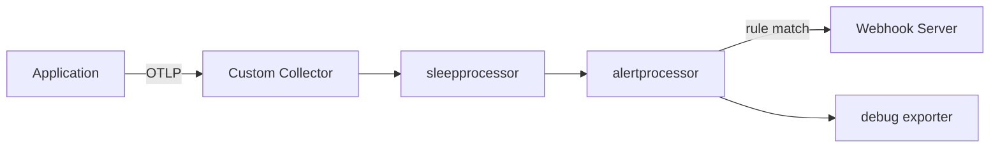

## Building a custom OpenTelemetry Collector with custom processor

### Objectives

The goal of this PoC is to create a customized version of the OpenTelemetry Collector using the OpenTelemetry Collector Builder (ocb). Two custom processors are implemented: `sleepprocessor`, which introduces a configurable async delay into the pipeline, and `alertprocessor`, which triggers webhook alerts based on rules matching `service.name` or span/metric attributes. A webhook server is included to receive and display the alerts.

### Prerequisites

- curl
- go
- ocb
- docker
- docker compose

### Architecture



### Reproducing

Download OpenTelemetry Collector Builder (ocb) — adjust the URL for your OS/arch
```sh
# linux/amd64
curl --proto '=https' --tlsv1.2 -fL -o ocb \
https://github.com/open-telemetry/opentelemetry-collector-releases/releases/download/cmd%2Fbuilder%2Fv0.135.0/ocb_0.135.0_linux_amd64

# darwin/arm64
curl --proto '=https' --tlsv1.2 -fL -o ocb \
https://github.com/open-telemetry/opentelemetry-collector-releases/releases/download/cmd%2Fbuilder%2Fv0.135.0/ocb_0.135.0_darwin_arm64

chmod +x ocb
sudo mv ocb /usr/local/bin
```

Build the custom collector (uses `builder-config.yaml` already present in the repo)
```sh
ocb --config builder-config.yaml
```

Start the webhook server (required for alertprocessor to deliver alerts)
```sh
cd webhook && go run main.go
```

Run the custom collector (uses `dist/config.yaml` already present in the repo)
```sh
./dist/custom-collector --config ./dist/config.yaml
```

Send a test trace that triggers the `critical-severity` alert rule
```sh
curl -X POST http://localhost:4318/v1/traces \
  -H "Content-Type: application/json" \
  -d '{
    "resourceSpans": [{
      "resource": {
        "attributes": [
          {"key": "service.name", "value": {"stringValue": "api-service"}}
        ]
      },
      "scopeSpans": [{
        "scope": {"name": "test-tracer"},
        "spans": [{
          "traceId": "22222222222222222222222222222222",
          "spanId": "2222222222222222",
          "name": "critical-operation",
          "kind": 1,
          "startTimeUnixNano": "1695000000000000000",
          "endTimeUnixNano": "1695000001000000000",
          "attributes": [
            {"key": "severity", "value": {"stringValue": "critical"}},
            {"key": "operation", "value": {"stringValue": "data-corruption"}}
          ]
        }]
      }]
    }]
  }'
```

The webhook server logs the received alert. Adjust alert rules in `dist/config.yaml` under `alertprocessor.alert_rules`.

### Results

Building a stripped-down collector with ocb is straightforward: one YAML file and a binary. The custom processor API is simple enough to implement logic like async delays or conditional webhooks with minimal boilerplate. The configuration file gives full control over rule parameters at runtime, making the collector a practical extension point for telemetry pipelines without patching upstream code.

### References

```
https://opentelemetry.io/docs/collector/custom-collector/
https://github.com/open-telemetry/opentelemetry-collector-releases/releases/
https://github.com/open-telemetry/opentelemetry-collector/tree/main/cmd/builder
https://opentelemetry.io/docs/collector/installation/
```
