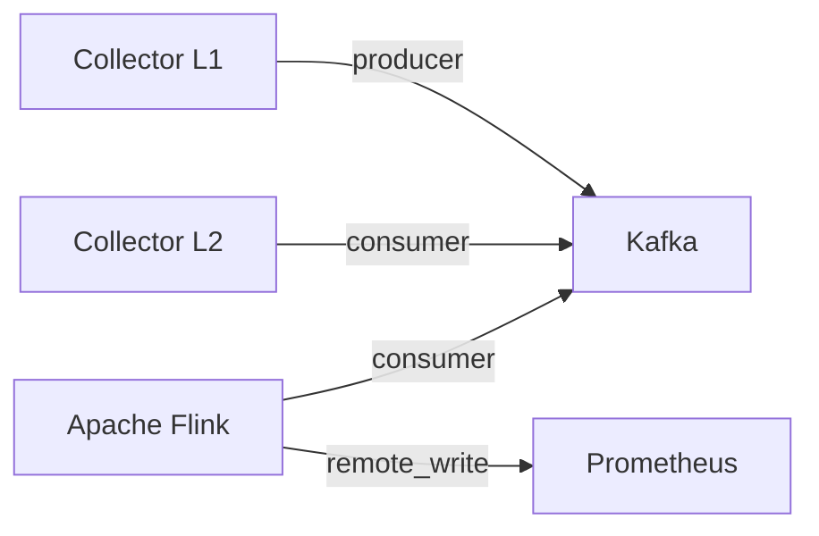

# Processing observability data at scale with Apache Flink

> **Author:** Vinícius Gomes Batista (*apolzek*)

Practical experiment evaluating Flink, Kafka, Prometheus and the OpenTelemetry Collector in a production-like context. Conclusions are empirical, based on tests run during implementation — not a formal study. Apache Flink and Machine Learning are still ongoing learning topics for the author, which may affect the depth of some analyses.

## Architecture



OTLP data is ingested by **Collector L1** and produced to Kafka, split by signal type and protocol (6 topics: `otlp-{traces,logs,metrics}-{grpc,http}`). **Collector L2** and **Flink** consume independently: L2 for forwarding, Flink for stateful counting. Counters are pushed to Prometheus via Remote Write and visualized in Grafana.

## Ports

| Service        | Port(s)                                 | Notes                              |
|----------------|-----------------------------------------|------------------------------------|
| Grafana        | 3000                                    | UI                                 |
| Flink UI       | 8082                                    | job status, task slots             |
| Flink RPC      | 6123                                    | internal RPC                       |
| Prometheus     | 9090                                    | remote write receiver enabled      |
| Kafka UI       | 8083                                    | topic inspection, lag              |
| Kafka          | 9092                                    | external listener (host)           |
| Kafka Exporter | 9308                                    | Prometheus metrics for Kafka       |
| Zookeeper      | 2181                                    | Kafka coordination                 |
| cAdvisor       | 8080                                    | per-container resource usage       |
| Collector L1   | 4317 (gRPC), 4318 (HTTP), 8888, 13133   | OTLP ingest; `network_mode: host`  |
| Collector L2   | 24133                                   | health check                       |

## Quickstart

### 1. Start the stack

```bash
docker compose up -d
```

Wait ~30 s for Kafka and Flink to become healthy.

```bash
docker compose ps
echo "Running: $(docker compose ps --services --filter status=running | grep -c .) out of $(docker compose ps --services | grep -c .)"
# Running: 10 out of 10
```

`flink-job-submitter` and `kafka-init` exit after finishing — expected.

### 2. Verify topics and job

```bash
# Kafka topics
docker exec kafka kafka-topics --bootstrap-server kafka:29092 --list
# → otlp-logs, otlp-metrics, otlp-traces (plus grpc/http variants)

# Flink job status (expect one RUNNING)
curl -s http://localhost:8082/jobs \
  | python3 -c "import sys,json;[print(j['id'],j['status']) for j in json.load(sys.stdin)['jobs']]"
```

### 3. Send test telemetry

Using [`telemetrygen`](https://github.com/open-telemetry/opentelemetry-collector-contrib/tree/main/cmd/telemetrygen):

```bash
telemetrygen traces  --otlp-insecure --workers 2 --rate 100 --duration 30s
telemetrygen logs    --otlp-insecure --workers 2 --rate 100 --duration 30s
telemetrygen metrics --otlp-insecure --workers 2 --rate 100 --duration 30s
```

Higher load with GNU `parallel`:

```bash
COMMON="--otlp-insecure --workers 8 --rate 2000 --duration 600s"
parallel ::: \
  "telemetrygen traces  $COMMON" \
  "telemetrygen logs    $COMMON" \
  "telemetrygen metrics $COMMON" \
  "telemetrygen traces  $COMMON --otlp-http" \
  "telemetrygen logs    $COMMON --otlp-http" \
  "telemetrygen metrics $COMMON --otlp-http"
```

Raw HTTP examples (traces, logs, metrics) are in [`explain.md`](./explain.md).

### 4. Open Grafana

[http://localhost:3000](http://localhost:3000) — dashboard auto-provisioned from `grafana/provisioning/dashboards/json/otlp-counter.json`.

### 5. Teardown

```bash
docker compose down -v
```

## Useful PromQL

### Flink

```promql
# Job alive
flink_job_alive{job="otlp-counter"}

# Messages/sec by signal type
sum by (telemetry_type)(rate(flink_otlp_messages_total[1m]))

# Bytes/sec
sum(rate(flink_otlp_bytes_total[1m]))

# Spans/sec
sum(rate(flink_otlp_spans_total{telemetry_type="traces"}[1m]))

# Consumer lag
kafka_consumergroup_lag_sum{consumergroup=~"flink.*"}
```

### OTel Collector

```promql
# L1 → Kafka (exported spans/sec)
rate(otelcol_exporter_sent_spans_total{job="otel-collector-l1",exporter="kafka/traces"}[1m])

# L2 ← Kafka (received spans/sec)
rate(otelcol_receiver_accepted_spans_total{job="otel-collector-l2"}[1m])

# L2 Kafka offset lag by topic
otelcol_kafka_receiver_offset_lag_ratio{job="otel-collector-l2"}

# Parity Flink vs L2 (5 min window)
sum(increase(flink_otlp_spans_total{telemetry_type="traces"}[5m]))
  / sum(increase(otelcol_receiver_accepted_spans_total{job="otel-collector-l2"}[5m]))
```

## Building Flink jobs from source

Requires Docker only — Maven runs in a container:

```bash
docker run --rm \
  -v "$(pwd)/flink-jobs/otlp-counter:/app" \
  -w /app \
  maven:3.9.6-eclipse-temurin-11 \
  mvn package -q -DskipTests

cp flink-jobs/otlp-counter/target/otlp-counter-1.0.0.jar flink-jobs/
```

`flink-job-submitter` picks up any `*.jar` in `./flink-jobs/` on startup and submits them.

## Images

`confluentinc/cp-zookeeper:7.5.0` · `confluentinc/cp-kafka:7.5.0` · `provectuslabs/kafka-ui:v0.7.2` · `otel/opentelemetry-collector-contrib:0.147.0` · `flink:1.20.1-scala_2.12-java11` · `ghcr.io/google/cadvisor` · `danielqsj/kafka-exporter:v1.9.0` · `prom/prometheus:v2.47.0` · `grafana/grafana:11.4.0` · `curlimages/curl:8.5.0`

## References

- [Flink Prometheus connector docs](https://nightlies.apache.org/flink/flink-docs-stable/docs/connectors/datastream/prometheus/)
- [apache/flink-connector-prometheus](https://github.com/apache/flink-connector-prometheus)
- [Scaling the OTel Collector](https://opentelemetry.io/docs/collector/scaling/)
- [Apache Flink](https://flink.apache.org/)
- [Flink stream processing use cases](https://www.confluent.io/blog/apache-flink-stream-processing-use-cases-with-examples/)
- [google/cadvisor](https://github.com/google/cadvisor)

---

See [`explain.md`](./explain.md) for a code-level walkthrough of `OtlpCounterJob` (state, timers, key design, known issues).
