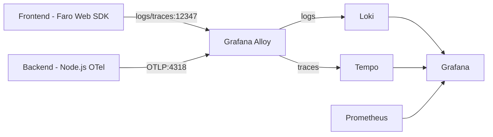

## Frontend Observability with Grafana Faro and Grafana Alloy

### Objectives

The goal of this PoC is to explore what observability data can be extracted from a browser-based frontend using Grafana Faro, and how to correlate it end-to-end with backend traces. A plain HTML/JS frontend is instrumented with the Faro Web SDK to capture logs, JavaScript errors, web vitals, and distributed traces. A Node.js backend is instrumented with OpenTelemetry. Both signal streams are collected by Grafana Alloy, which routes logs to Loki and traces to Tempo, with everything visualized in Grafana.

### Architecture



The frontend propagates W3C Trace Context headers (`traceparent`) on every API call to the backend, linking frontend and backend spans under the same trace ID.

### Services

| Service    | Port             | Image                   |
| ---------- | ---------------- | ----------------------- |
| grafana    | 3000             | grafana/grafana:10.4.0  |
| loki       | 3100             | grafana/loki:latest     |
| tempo      | 3200, 4317, 4318 | grafana/tempo:2.4.1     |
| prometheus | 9090             | prom/prometheus:v2.51.0 |
| alloy      | 12347, 12348     | grafana/alloy:v1.0.0    |

### Prerequisites

- docker
- docker compose
- node (v18+)
- npm

### Reproducing

Start the observability stack
```sh
docker compose up -d
```

Install backend dependencies and start the backend (port 3002)
```sh
cd backend
npm install
node --require ./instrumentation.js app.js
```

Open the frontend in a browser
```sh
open frontend/index.html
```

The frontend sends telemetry to Alloy at `http://localhost:12347/collect` and API requests to the backend at `http://localhost:3002/api`.

Verify signal collection
- Grafana: http://localhost:3000 (admin / admin123)
  - Explore → Loki: query `{service_name="frontend"}` for browser logs
  - Explore → Tempo: search traces by service `frontend` or `backend`
- Alloy admin: http://localhost:12348

Use the item manager UI to generate signals — add, edit, and delete items. The frontend is configured with simulated random failures (30% on load, 20% on add) to produce error traces and logs automatically.

### Results

Grafana Faro captures a wider range of browser signals than typical RUM tools: JavaScript exceptions, console output, web vitals (LCP, FID, CLS), user-initiated spans, and W3C trace context propagation to the backend. The trace correlation works — a span created in the browser for `items.load` links to the backend span for `items.list` under the same trace ID. Grafana Alloy simplifies collection by accepting both Faro payloads and OTLP data in a single agent, removing the need for a separate OTel Collector. The main limitation is that trace context injection via `propagation.inject` only works when a span is active at the time of the fetch call, which requires wrapping all API requests inside an active span context.

### References

```
https://github.com/grafana/faro-web-sdk
https://grafana.com/docs/grafana-cloud/monitor-applications/frontend-observability/instrument/
https://github.com/grafana/faro-web-sdk/blob/main/docs/sources/tutorials/quick-start-browser.md
https://github.com/grafana/faro-web-sdk/tree/main/packages/web-tracing
https://grafana.com/grafana/dashboards/17766-frontend-monitoring/
https://github.com/blueswen/observability-ironman30-lab/blob/6fbf4e32f915f2e83ea4141a7defa6334991cd81/app/todo-app/jquery-app/index.html#L34
```
