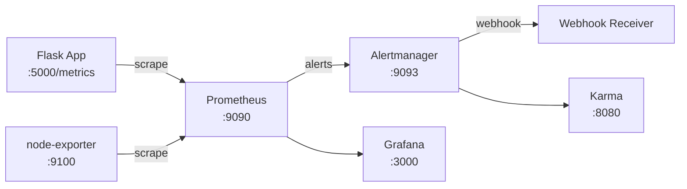

## Alerting with Prometheus, Alertmanager, Karma, and a Flask Application

### Objectives

The goal of this PoC is to build a complete alerting pipeline using Prometheus and Alertmanager, triggered by metrics from a Flask application. The Flask app exposes Counter, Histogram, Gauge, and Summary metrics via the `prometheus_client` library. An alert rule fires when the request count exceeds a threshold. Alertmanager routes the alert to a webhook. Karma provides a dashboard for alert management and silencing.

### Architecture



### Services

| Service       | Port | Image                          |
| ------------- | ---- | ------------------------------ |
| flask-app     | 5000 | custom (flask-app/Dockerfile)  |
| prometheus    | 9090 | prom/prometheus                |
| alertmanager  | 9093 | prom/alertmanager:v0.27.0      |
| grafana       | 3000 | grafana/grafana                |
| karma         | 8080 | ghcr.io/prymitive/karma:latest |
| node-exporter | 9100 | prom/node-exporter:v1.7.0      |

### Prerequisites

- docker
- docker compose

### Reproducing

Start the stack
```sh
docker compose up -d
```

Generate traffic to trigger alerts
```sh
bash fake-requests.sh
```

The script sends requests to `/`, `/increment`, and `/decrement` in a loop, accumulating `app_request_count_total`. The alert `HighAppCount` fires when the total exceeds 5 for 1 minute.

Verify the pipeline
- Prometheus alerts: http://localhost:9090/alerts
- Alertmanager: http://localhost:9093
- Karma: http://localhost:8080
- Grafana: http://localhost:3000

To change the webhook destination, edit `alertmanager/alertmanager.yml` and update the `url` under `webhook_configs`.

### Results

The pipeline from metric to alert to notification works end-to-end with minimal configuration. The Flask `prometheus_client` integration is straightforward — metrics are declared as module-level objects and observed inside route handlers. Karma adds value over the Alertmanager UI by grouping and filtering alerts across multiple Alertmanager instances, which is useful in larger environments. The main limitation of this setup is that the alert threshold (`app_request_count_total > 5`) is cumulative and never resets without a process restart, making it more suitable for demonstrating the pipeline than for real alerting logic.

### References

```
https://github.com/prometheus/client_python
https://prometheus.io/docs/alerting/latest/alertmanager/
https://github.com/prymitive/karma
https://prometheus.io/docs/prometheus/latest/configuration/alerting_rules/
```
