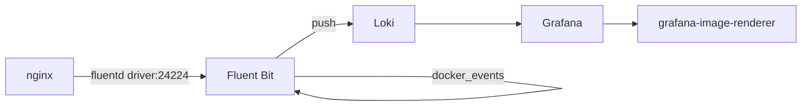

## Collecting Docker Logs with Fluent Bit and Loki

### Objectives

The goal of this PoC is to collect Docker container logs using Fluent Bit and ship them to Loki for visualization in Grafana. Fluent Bit receives logs from Docker containers via the `fluentd` logging driver and from the Docker events API, then forwards them to Loki. An nginx container serves as the log source, and a Grafana image renderer is included for dashboard snapshots.

### Architecture



### Services

| Service                | Port  | Image                                 |
| ---------------------- | ----- | ------------------------------------- |
| fluent-bit             | 24224 | custom (Dockerfile in fluent-bit/)    |
| loki                   | 3100  | grafana/loki:latest                   |
| grafana                | 3000  | grafana/grafana:latest                |
| grafana-image-renderer | 8081  | grafana/grafana-image-renderer:latest |
| nginx                  | 8080  | nginx:latest                          |

### Prerequisites

- docker
- docker compose

### Reproducing

Start the stack

```sh
docker compose up -d --build
```

Generate nginx access logs

```sh
curl http://localhost:8080
```

Open Grafana at http://localhost:3000, add Loki as a datasource (`http://loki:3100`), then query:

```
{job="fluent-bit"}
```

Filter by the `container_name` label to isolate logs from a specific container.

To change monitored log sources, edit `fluent-bit/conf/fluent.conf` and run `docker compose restart fluent-bit`.

### Results

Fluent Bit collects Docker container logs through two inputs: the `forward` protocol (Docker's `fluentd` logging driver) and `docker_events` for container lifecycle events. The `grafana-loki` output plugin ships logs with automatic label extraction from `container_name`. No custom log parsing is required for standard Docker JSON logs. The main constraint is that Fluent Bit must be healthy before any container using the `fluentd` logging driver starts, otherwise Docker will fail to launch those containers.

### References

```
https://docs.fluentbit.io/manual/pipeline/inputs/forward
https://docs.fluentbit.io/manual/pipeline/outputs/loki
https://grafana.com/docs/loki/latest/
```
