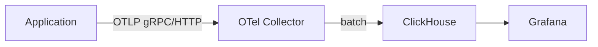

## Storing OpenTelemetry Data in ClickHouse

### Objectives

The goal of this PoC is to use ClickHouse as a backend for OpenTelemetry telemetry data. The OpenTelemetry Collector receives traces via OTLP and exports them directly to ClickHouse using the `clickhouse` exporter, which creates the schema automatically. Grafana visualizes the stored data using the `grafana-clickhouse-datasource` plugin.

### Architecture



### Services

| Service        | Port       | Image                                     |
| -------------- | ---------- | ----------------------------------------- |
| otel-collector | 4317, 4318 | otel/opentelemetry-collector-contrib:latest |
| clickhouse     | 8123, 9000 | clickhouse/clickhouse-server:latest       |
| grafana        | 3000       | grafana/grafana:latest                    |

### Prerequisites

- docker
- docker compose

### Reproducing

Start the stack

```sh
docker compose up -d
```

Wait for ClickHouse to be healthy (the collector depends on it)

```sh
docker compose ps
```

Send a test trace

```sh
curl -X POST http://localhost:4318/v1/traces \
  -H "Content-Type: application/json" \
  -d '{
    "resourceSpans": [{
      "resource": {
        "attributes": [{
          "key": "service.name",
          "value": {"stringValue": "test-service"}
        }]
      },
      "scopeSpans": [{
        "spans": [{
          "traceId": "1234567890abcdef1234567890abcdef",
          "spanId": "1234567890abcdef",
          "name": "test-span",
          "startTimeUnixNano": "1640995200000000000",
          "endTimeUnixNano": "1640995201000000000"
        }]
      }]
    }]
  }'
```

Verify data arrived in ClickHouse

```sh
docker compose exec clickhouse clickhouse-client --query "SHOW TABLES"
docker compose exec clickhouse clickhouse-client --query "SELECT COUNT(*) FROM otel_traces"
```

Open Grafana at http://localhost:3000 (admin / admin). The ClickHouse datasource is pre-provisioned. Query the `otel_traces` table directly using the ClickHouse datasource.

### Results

The `clickhouse` exporter in the OTel Collector contrib distribution handles schema creation automatically on first run, creating `otel_traces`, `otel_logs`, and `otel_metrics` tables. Data is batched with LZ4 compression before writing. ClickHouse's columnar storage makes it efficient for trace queries over large time ranges. Grafana's ClickHouse plugin supports raw SQL queries, which gives full flexibility over how trace data is sliced but requires more manual query construction compared to purpose-built trace UIs like Tempo.

### References

```
https://github.com/open-telemetry/opentelemetry-collector-contrib/tree/main/exporter/clickhouseexporter
https://grafana.com/grafana/plugins/grafana-clickhouse-datasource/
https://clickhouse.com/docs/en/intro
```
