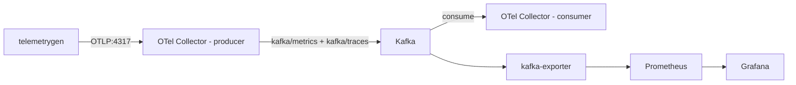

## Distributed Observability Pipeline with OpenTelemetry and Kafka

### Objectives

The goal of this PoC is to build a decoupled observability pipeline where a producer OpenTelemetry Collector receives OTLP data and exports it to Kafka, and a consumer OpenTelemetry Collector reads from Kafka and processes it downstream. `telemetrygen` is used to generate high-cardinality metrics at load, simulating real-world pressure on the pipeline. Kafka-exporter exposes Kafka consumer lag metrics to Prometheus, and Grafana provides visibility over both the pipeline and Kafka internals.

### Architecture



### Services

| Service                        | Port       | Image                                       |
| ------------------------------ | ---------- | ------------------------------------------- |
| zookeeper                      | 2181       | confluentinc/cp-zookeeper:7.9.0             |
| kafka                          | 29092      | confluentinc/cp-kafka:7.9.0                 |
| kafka-ui                       | 8080       | provectuslabs/kafka-ui:latest               |
| opentelemetry-collector-producer | 4317, 4318 | otel/opentelemetry-collector-contrib:0.118.0 |
| opentelemetry-collector-consumer | 9005      | otel/opentelemetry-collector-contrib:0.118.0 |
| kafka-exporter                 | 9308       | danielqsj/kafka-exporter:latest             |
| prometheus                     | 9090       | prom/prometheus:v2.45.0                     |
| grafana                        | 3000       | grafana/grafana                             |

### Prerequisites

- docker
- docker compose
- telemetrygen (`go install github.com/open-telemetry/opentelemetry-collector-contrib/cmd/telemetrygen@latest`)

### Reproducing

Start the stack

```sh
docker compose up -d
```

Wait for Kafka to be healthy

```sh
docker compose ps
```

Send metrics through the producer collector

```sh
telemetrygen metrics --otlp-endpoint localhost:4317 --otlp-insecure --duration 60s --rate 50 --workers 10 --metric-type Sum --otlp-metric-name test_metric --service "test-otel"
```

To simulate high cardinality load

```sh
telemetrygen metrics \
  --otlp-endpoint localhost:4317 \
  --otlp-insecure \
  --duration 300s \
  --rate 1000 \
  --workers 50 \
  --metric-type Gauge \
  --otlp-attributes="user_id=\"user-$(shuf -i 1-100000 -n 1)\"" \
  --otlp-attributes="session_id=\"session-$(uuidgen)\"" \
  --otlp-attributes="endpoint=\"/api/v1/endpoint-$(shuf -i 1-500 -n 1)\"" \
  --service "high-cardinality-service"
```

Verify data flow

- Kafka UI: http://localhost:8080 — inspect topics and consumer lag
- Prometheus: http://localhost:9090 — query `kafka_consumergroup_lag`
- Grafana: http://localhost:3000 — pre-provisioned dashboards for OTel Collector and Kafka

### Results

The producer/consumer split decouples ingestion from processing. Kafka absorbs bursts and provides backpressure visibility through consumer lag metrics. The `kafka-exporter` + Prometheus combination gives real-time insight into whether the consumer collector is keeping pace with the producer. High-cardinality `telemetrygen` runs confirm that the pipeline sustains throughput without dropping data, as long as Kafka topic partitions and consumer concurrency are sized appropriately.

### References

```
https://grafana.com/grafana/dashboards/15983-opentelemetry-collector/
https://grafana.com/grafana/dashboards/7589-kafka-exporter-overview/
https://github.com/open-telemetry/opentelemetry-collector-contrib/tree/main/receiver/kafkareceiver
https://github.com/open-telemetry/opentelemetry-collector-contrib/tree/main/exporter/kafkaexporter
https://github.com/open-telemetry/opentelemetry-collector-contrib/cmd/telemetrygen
```
