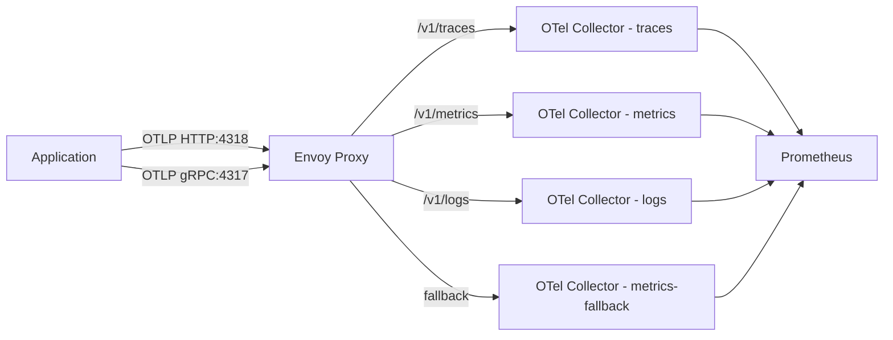

## OpenTelemetry Signal Routing with Envoy Proxy

### Objectives

The goal of this PoC is to use Envoy Proxy as a gateway that routes OTLP signals to specialized OpenTelemetry Collectors based on signal type. Traces, metrics, and logs each go to a dedicated collector instance. A fourth collector acts as a fallback for metrics. Prometheus scrapes all collectors and Envoy's own stats endpoint, providing visibility over the entire routing layer.

### Architecture



### Services

| Service                       | Port       | Image                                       |
| ----------------------------- | ---------- | ------------------------------------------- |
| envoy                         | 4317, 4318, 9901 | envoyproxy/envoy:latest               |
| otel-collector-traces         | 8888       | otel/opentelemetry-collector-contrib:latest |
| otel-collector-metrics        | 8889       | otel/opentelemetry-collector-contrib:latest |
| otel-collector-logs           | 8890       | otel/opentelemetry-collector-contrib:latest |
| otel-collector-metrics-fallback | 8891     | otel/opentelemetry-collector-contrib:latest |
| prometheus                    | 9090       | prom/prometheus:latest                      |

### Prerequisites

- docker
- docker compose
- telemetrygen (optional, for load testing)

### Reproducing

Start the stack

```sh
docker compose up -d
```

Send traces via HTTP

```sh
curl -X POST http://localhost:4318/v1/traces \
  -H "Content-Type: application/json" \
  -d '{
    "resourceSpans": [{
      "resource": {
        "attributes": [{"key": "service.name", "value": {"stringValue": "test-service"}}]
      },
      "scopeSpans": [{
        "spans": [{
          "traceId": "5B8EFFF798038103D269B633813FC60C",
          "spanId": "EEE19B7EC3C1B174",
          "name": "test-span",
          "kind": 1,
          "startTimeUnixNano": "1544712660000000000",
          "endTimeUnixNano": "1544712661000000000"
        }]
      }]
    }]
  }'
```

Send metrics via HTTP

```sh
curl -X POST http://localhost:4318/v1/metrics \
  -H "Content-Type: application/json" \
  -d '{
    "resourceMetrics": [{
      "resource": {"attributes": [{"key": "service.name", "value": {"stringValue": "test-service"}}]},
      "scopeMetrics": [{
        "metrics": [{
          "name": "test_counter",
          "sum": {
            "dataPoints": [{"asInt": "42", "timeUnixNano": "1544712660000000000"}],
            "aggregationTemporality": 2,
            "isMonotonic": true
          }
        }]
      }]
    }]
  }'
```

Or use `telemetrygen` for continuous load

```sh
telemetrygen traces --otlp-insecure --otlp-endpoint localhost:4317 --duration 10s --rate 10
telemetrygen metrics --otlp-insecure --otlp-endpoint localhost:4317 --duration 10s --rate 10
telemetrygen logs --otlp-insecure --otlp-endpoint localhost:4317 --duration 10s --rate 10
```

Verify routing via the Envoy admin interface

```sh
# Check cluster routing stats
curl http://localhost:9901/clusters

# Check Prometheus metrics from Envoy
curl http://localhost:9901/stats/prometheus
```

Check collector reception in Prometheus

```sh
# Traces received
http://localhost:9090/graph?g0.expr=otelcol_receiver_accepted_spans

# Metrics received
http://localhost:9090/graph?g0.expr=otelcol_receiver_accepted_metric_points

# Logs received
http://localhost:9090/graph?g0.expr=otelcol_receiver_accepted_log_records
```

### Results

Envoy routes OTLP HTTP traffic based on the request path (`/v1/traces`, `/v1/metrics`, `/v1/logs`), sending each signal type to its own collector instance. This separates concerns at the infrastructure level — each collector can be scaled, configured, and exported independently. The Envoy admin endpoint provides real-time routing stats and circuit breaker state. The main limitation is that gRPC multiplexes all signal types over a single connection, so path-based routing only works cleanly with OTLP HTTP.

### References

```
https://www.envoyproxy.io/docs/envoy/latest/
https://opentelemetry.io/docs/specs/otlp/
https://github.com/open-telemetry/opentelemetry-collector-contrib/cmd/telemetrygen
```
