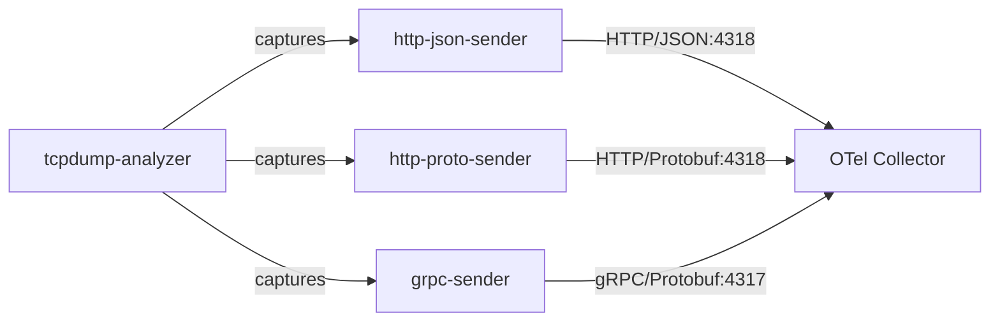

## Analyzing OTLP Protocol Encodings with tcpdump

### Objectives

The goal of this PoC is to compare the three OTLP transport encodings — HTTP/JSON, HTTP/Protobuf, and gRPC/Protobuf — by capturing their network traffic with tcpdump. Three Python sender services continuously emit traces using each encoding. A dedicated `tcpdump-analyzer` container provides a shell with network analysis tools to inspect and compare the captured packets in real time.

### Architecture



### Services

| Service           | Port       | Description                        |
| ----------------- | ---------- | ---------------------------------- |
| otel-collector    | 4317, 4318 | otel/opentelemetry-collector-contrib:latest |
| http-json-sender  | —          | Python sender using OTLP HTTP/JSON |
| http-proto-sender | —          | Python sender using OTLP HTTP/Protobuf |
| grpc-sender       | —          | Python sender using OTLP gRPC      |
| tcpdump-analyzer  | —          | Debian container with tcpdump/tshark |

### Prerequisites

- docker
- docker compose

### Reproducing

Start the stack

```sh
docker compose up -d --build
```

Verify all senders are running and emitting data

```sh
docker logs -f http-json-sender
docker logs -f http-proto-sender
docker logs -f grpc-sender
docker logs otel-collector
```

Open a shell in the analyzer container

```sh
docker exec -it tcpdump-analyzer bash
```

Capture all OTLP traffic

```sh
tcpdump -i any port 4317 or port 4318 -nn -v
```

Inspect HTTP/JSON payloads (human-readable)

```sh
tcpdump -i any port 4318 -A -s 0
```

Inspect gRPC binary frames

```sh
tcpdump -i any port 4317 -X -s 0
```

Save captures for offline analysis

```sh
tcpdump -i any port 4318 -w /tmp/http.pcap -s 0
tcpdump -i any port 4317 -w /tmp/grpc.pcap -s 0
```

Compare packet sizes across protocols

```sh
tcpdump -i any port 4317 or port 4318 -nn -q -c 50
```

To analyze only one sender at a time, stop the others

```sh
docker compose stop http-json-sender
docker compose stop http-proto-sender
```

### Results

HTTP/JSON payloads are fully human-readable in tcpdump with the `-A` flag, making them the easiest to debug without additional tooling. HTTP/Protobuf uses the same port (4318) but produces binary output that requires protobuf decoding to inspect. gRPC frames are binary HTTP/2, making them opaque in tcpdump without tshark or Wireshark's HTTP/2 dissector. In terms of payload size, Protobuf encodings (both HTTP and gRPC) are significantly more compact than JSON for the same trace data. gRPC provides the best throughput characteristics due to HTTP/2 multiplexing but requires more complex tooling to inspect.

### References

```
https://opentelemetry.io/docs/specs/otlp/
https://www.tcpdump.org/manpages/tcpdump.1.html
https://tshark.dev/
https://github.com/open-telemetry/opentelemetry-proto
```
