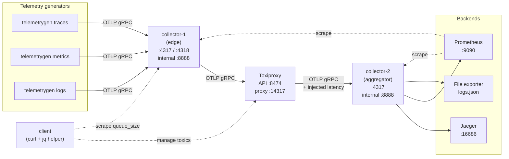

# Does injected latency cause queue buildup between OTel collectors?

> **Author:** Vinícius Gomes Batista (*apolzek*)

This PoC answers a single question: **when the network between two OpenTelemetry collectors gets slower, does the exporter's sending queue start to grow?** Latency is injected with [Toxiproxy](https://github.com/Shopify/toxiproxy) between `collector-1` (edge) and `collector-2` (aggregator), and the `otelcol_exporter_queue_size` metric on `collector-1` is sampled while each latency scenario runs. The goal is not to break the pipeline — it is to see at which point added RTT stops being absorbed by the batch processor and starts showing up as queued work.

## Objectives

- Measure whether added network latency produces backlog on `collector-1`'s sending queue
- Identify the latency threshold at which the queue stops draining as fast as it fills
- Observe send failures / dropped spans when the retry budget is exhausted
- Do it all via `docker compose` so no tooling is required on the host beyond Docker

## Prerequisites

- Docker 20.10+ with Compose v2
- ~1 GB free RAM

## Architecture



Signal flow: `generators → collector-1 → [Toxiproxy adds latency] → collector-2 → Jaeger / Prometheus / file`.

The `client` service is a long-running Alpine container with `curl` and `jq`; every operation in the test script runs through `docker compose exec client`, so Toxiproxy and the collector's `/metrics` endpoint are always reached from inside the compose network.

## Project layout

```
.
├── docker-compose.yml
├── test-latency.sh              # driver script — runs every scenario through `docker compose exec`
├── config/
│   ├── otel-collector-1.yaml    # edge collector, exposes internal metrics on :8888
│   ├── otel-collector-2.yaml    # aggregator collector
│   └── prometheus.yml
└── toxiproxy/
    ├── toxiproxy.json           # declares the otel-collector proxy (14317 → otel-collector-2:4317)
    └── setup.sh                 # creates the initial latency toxic on boot
```

The edge collector (`collector-1`) has an explicit `sending_queue` (`queue_size: 1000`, `num_consumers: 2`) and a 60 s retry budget, so queue growth and dropped batches are both observable.

## Reproducing

Bring the stack up:

```bash
docker compose up -d
```

Run every scenario in sequence:

```bash
./test-latency.sh
```

Run a single scenario:

```bash
./test-latency.sh baseline    # 0 ms
./test-latency.sh low         # 50 ms   ± 10 ms
./test-latency.sh medium      # 200 ms  ± 30 ms
./test-latency.sh high        # 800 ms  ± 100 ms
./test-latency.sh critical    # 2000 ms ± 500 ms
./test-latency.sh restore     # remove all toxics
```

The script runs every command (toxiproxy API calls and `/metrics` scrapes) inside the compose network via `docker compose exec client …` — the host only needs Docker.

For each scenario it:

1. removes any existing toxic and waits 15 s for the queue to drain,
2. applies the latency toxic,
3. samples `otelcol_exporter_queue_size` every 3 s for 45 s,
4. records the peak queue size and the number of `send_failed_spans` accumulated during the window,
5. prints a comparison table at the end.

## Manual inspection

```bash
# Toxics currently applied
docker compose exec client curl -s http://toxiproxy:8474/proxies/otel-collector/toxics | jq

# Change latency at runtime without restarting anything
docker compose exec client curl -s -X POST http://toxiproxy:8474/proxies/otel-collector/toxics/latency \
  -H 'Content-Type: application/json' \
  -d '{"attributes":{"latency":300,"jitter":50}}'

# Look at the queue size right now
docker compose exec client sh -c 'curl -s http://otel-collector-1:8888/metrics | grep ^otelcol_exporter_queue_size'
```

Dashboards:

| UI | URL |
|---|---|
| Jaeger | http://localhost:16686 |
| Prometheus | http://localhost:9090 |
| Toxiproxy API | http://localhost:8474/proxies |

Relevant PromQL:

```promql
otelcol_exporter_queue_size{exporter="otlp"}
otelcol_exporter_queue_capacity{exporter="otlp"}
rate(otelcol_exporter_send_failed_spans_total{exporter="otlp"}[1m])
```

## Reading the results

The output table has one row per scenario with peak queue size and dropped spans:

| scenario | latency | jitter | peak queue_size | failed_spans |
|---|---|---|---|---|
| baseline | 0 ms | ±0 ms | ~0 | 0 |
| low | 50 ms | ±10 ms | ~0 | 0 |
| medium | 200 ms | ±30 ms | small growth | 0 |
| high | 800 ms | ±100 ms | sustained growth | possibly > 0 |
| critical | 2000 ms | ±500 ms | near queue_capacity | > 0 |

What the numbers mean:

- **peak queue_size ≈ 0** — each export finishes before the next batch is enqueued. The batch processor's 5 s window absorbs the extra RTT; latency is invisible to the pipeline.
- **peak queue_size grows but stable** — exports take long enough that batches pile up, but `num_consumers` still drains the queue at roughly the incoming rate. Data is delayed, not lost.
- **peak queue_size approaches `queue_capacity`** — the queue fills faster than it drains. Backpressure starts propagating to the receiver; new batches are rejected.
- **failed_spans > 0** — the 60 s retry budget ran out. Those spans are gone.

So the answer to the motivating question is not a yes/no: it's a threshold. Below that threshold, added latency is fully absorbed by batching + gRPC; above it, queue growth is linear in the gap between ingress rate and export rate, and eventually hits capacity.

## References

```
🔗 https://github.com/Shopify/toxiproxy
🔗 https://opentelemetry.io/docs/collector/configuration/#processors
🔗 https://github.com/open-telemetry/opentelemetry-collector/blob/main/exporter/exporterhelper/README.md
🔗 https://opentelemetry.io/docs/collector/internal-telemetry/
```
