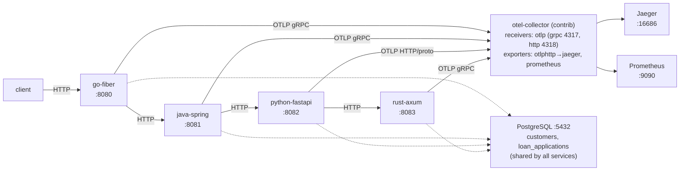

## Polyglot distributed tracing with OpenTelemetry across Go, Java, Python and Rust

### Objectives

Exercise cross-language trace context propagation in a single request by chaining four services written in different languages and runtimes behind a loan-application workflow. The request enters a Go Fiber gateway, calls a Java Spring compliance service, then a Python FastAPI fraud service, which in turn calls a Rust Axum pricing service — all sharing a PostgreSQL database and reporting spans, metrics and logs to an OpenTelemetry Collector. The goal is to validate that W3C Trace Context survives every hop (gRPC and HTTP, both OTLP gRPC and HTTP/protobuf), that a single end-to-end trace shows up in Jaeger with spans from all four languages, and that Prometheus scrapes collector-exported metrics for the full pipeline.

### Prerequisites

- docker
- docker compose
- ~4 GB of RAM free (JVM and Rust build are the biggest contributors)

### Architecture



### Reproducing

Bring up the full stack:

```bash
docker compose up --build
```

Seed data is loaded from `init-db/init.sql` — five sample customers (`CUST-001` … `CUST-005`) with different credit scores and account ages.

Submit a loan application through the Go Fiber gateway:

```bash
curl -X POST http://localhost:8080/loans \
  -H 'Content-Type: application/json' \
  -d '{
    "customer_id": "CUST-001",
    "amount": 5000,
    "currency": "USD",
    "purpose": "home-improvement"
  }'
```

Inspect the resulting distributed trace:

| UI | URL |
|---|---|
| Jaeger | http://localhost:16686 |
| Prometheus | http://localhost:9090 |
| Collector self-metrics | http://localhost:8888/metrics |
| Collector Prometheus exporter | http://localhost:8889/metrics |

In Jaeger, search the `go-fiber` service — a single trace should contain spans from `go-fiber`, `java-spring`, `python-fastapi` and `rust-axum`, along with database spans for the PostgreSQL calls. Check that each service's exporter protocol matches what its collector receiver expects:

| Service | Endpoint env | Protocol |
|---|---|---|
| go-fiber | `otel-collector:4317` | OTLP gRPC |
| java-spring | `http://otel-collector:4317` | OTLP gRPC |
| python-fastapi | `http://otel-collector:4318` | OTLP HTTP/protobuf |
| rust-axum | `http://otel-collector:4317` | OTLP gRPC |

Tear down:

```bash
docker compose down -v
```

### Results

The most interesting validation is the end-to-end trace: propagating the same `traceparent` header through Go → Java → Python → Rust, over a mix of gRPC and HTTP transports, produces a single trace in Jaeger without any manual glue — each language's auto-instrumentation (otelfiber / otelhttp, OpenTelemetry Java agent, FastAPI instrumentation, tracing-opentelemetry for Axum) picks up the context correctly. The PoC also highlights how heterogeneous the OTLP ecosystem is in practice: Python defaults to HTTP/protobuf while Go/Java/Rust happily use gRPC, so the collector has to speak both receivers at once. Prometheus scraping the collector's `prometheus` exporter is enough to expose per-service RED metrics without any service-specific scrape configuration, which is a nice demonstration of why running a collector as a local hop pays off once you have more than one runtime in the mix.

### References

```
🔗 https://opentelemetry.io/docs/specs/otel/context/api-propagators/
🔗 https://opentelemetry.io/docs/languages/go/
🔗 https://opentelemetry.io/docs/zero-code/java/agent/
🔗 https://opentelemetry.io/docs/languages/python/
🔗 https://github.com/tokio-rs/tracing-opentelemetry
🔗 https://opentelemetry.io/docs/collector/
```
