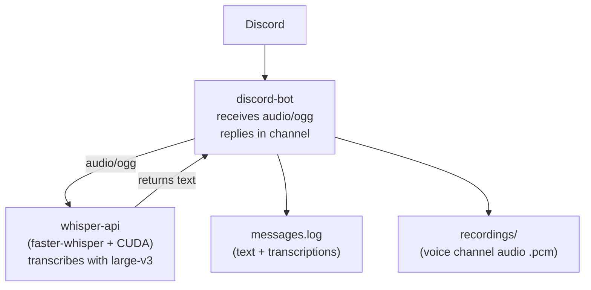

## Discord bot with local Whisper transcription on GPU

### Objectives

Build a Discord bot that watches a specific text channel, transcribes voice messages locally with [faster-whisper](https://github.com/SYSTRAN/faster-whisper) running on a CUDA GPU, and records audio from the voice channel. The PoC shows how to decouple a chat bot from the heavy model by exposing Whisper as an independent HTTP service — keeping the bot lightweight and letting the GPU workload be swapped, scaled, or replaced without touching the Discord integration.

### Prerequisites

- Docker + Docker Compose
- NVIDIA GPU with driver ≥ 525 and [NVIDIA Container Toolkit](https://docs.nvidia.com/datacenter/cloud-native/container-toolkit/install-guide.html)
- Discord bot created at the [Developer Portal](https://discord.com/developers/applications) with permissions: `Read Messages`, `Connect`, `Speak`, `View Channel`
- Intents enabled: `SERVER MEMBERS INTENT`, `MESSAGE CONTENT INTENT`

### Architecture



### Reproducing

Edit `discord-bot/.env` with the bot token:

```env
DISCORD_TOKEN=your_token_here
APPLICATION_ID=your_application_id_here
```

Run with Docker:

```bash
docker compose up --build
```

The `whisper-api` downloads the `large-v3` model (~3 GB) on the first run and stores it in a volume. Subsequent runs start in seconds. The `discord-bot` waits for the API health check before starting.

Run without Docker (development):

```bash
# Terminal 1 — Whisper API
cd whisper-api
./start.sh

# Terminal 2 — Bot
cd discord-bot
npm install
node index.js
```

Behaviour summary:

| Event | Action |
|---|---|
| Text message in the `robo` channel | Saved to `messages.log` |
| Audio file (`audio/*`) in the `robo` channel | Transcribed via Whisper and replied in the channel |
| User joins the `robo` voice channel | Bot joins and records audio to `.pcm` |
| Voice channel becomes empty | Bot leaves automatically |

Whisper API endpoints:

- `GET /health` — service status (`model`, `device`)
- `POST /transcribe` — multipart upload (`file`, optional `language`)

Quick test:

```bash
curl -X POST http://localhost:8001/transcribe \
  -F "file=@audio.ogg" \
  -F "language=pt"
```

Environment variables for the Whisper service:

| Variable | Default | Description |
|---|---|---|
| `WHISPER_MODEL` | `large-v3` | `tiny`, `base`, `small`, `medium`, `large-v3` |
| `WHISPER_DEVICE` | `cuda` | `cuda` for GPU, `cpu` for CPU |
| `WHISPER_COMPUTE` | `float16` | `float16` (GPU), `int8` (CPU or low-VRAM GPU) |

### Results

Splitting the bot from the model turned out to be the right boundary: the Node.js bot stays tiny and event-driven, while the Python/CUDA service owns all model concerns. Swapping model size (`tiny` → `large-v3`) becomes a single environment variable change with no bot redeploy. Running `large-v3` locally gives transcription quality close to commercial APIs while keeping all audio on the machine, which matters when the voice data is private. The main friction is the model size on first boot and the VRAM cost — on a 6 GB GPU `large-v3` fits only at `float16`, and falling back to `int8` is a practical workaround when sharing the GPU with other workloads.

### References

```
🔗 https://github.com/SYSTRAN/faster-whisper
🔗 https://discord.js.org/
🔗 https://docs.nvidia.com/datacenter/cloud-native/container-toolkit/install-guide.html
🔗 https://github.com/openai/whisper
```
