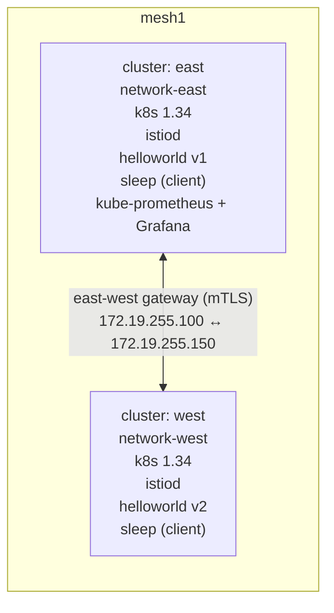

## Multi-cluster Istio mesh on Kind with Grafana observability

### Objectives

Stand up **two** Kubernetes clusters locally with Kind, join them into a
single Istio service mesh using the **multi-primary / multi-network**
topology, and wire up a production-style observability stack
(`kube-prometheus-stack` + Grafana with the official Istio dashboards) so
you can watch the cross-cluster traffic flow in real time.

The install uses Helm charts for every component (`istio/base`,
`istio/istiod`, `istio/gateway`, `prometheus-community/kube-prometheus-stack`,
`metallb/metallb`). `istioctl` is used **only** as a client-side helper to
generate the remote-cluster Secrets — not as a runtime dependency — so the
same values files can be reused against real clusters via `helm upgrade
--install` in a GitOps pipeline.

### Architecture



Key design choices:

| # | Decision                                                   | Why                                                                                                      |
|---|------------------------------------------------------------|----------------------------------------------------------------------------------------------------------|
| 1 | Multi-primary, multi-network                               | Each cluster runs its own `istiod`, so control-plane failures are isolated. Production-grade topology.   |
| 2 | Shared intermediate CA (single `cacerts` secret)           | Workloads in both clusters trust the same root, enabling mTLS across the east-west gateway.              |
| 3 | MetalLB in L2 mode                                         | Kind has no cloud LB. MetalLB hands real IPs from the `kind` docker bridge (`172.19.0.0/16`).             |
| 4 | East-west gateway with `AUTO_PASSTHROUGH`                  | SNI-routed, no TLS termination at the gateway. Required by the Istio multi-network pattern.              |
| 5 | Helm charts for everything                                 | Same artifacts you would ship via Argo/Flux. `istioctl install` is avoided on purpose.                    |
| 6 | Upstream Istio dashboards via `dashboards:` Helm values    | `gnetId`-based import from grafana.com — real dashboards, not a custom one. Revision pinned (235).        |

### Versions

| Component                | Version                |
|--------------------------|------------------------|
| Kind                     | v0.31.0                |
| Kubernetes node image    | `kindest/node:v1.34.0` |
| Istio (helm charts)      | **1.29.2**             |
| MetalLB                  | v0.14.8                |
| kube-prometheus-stack    | 83.4.2                 |

### Prerequisites

- Docker running
- `kind` >= 0.31
- `kubectl` >= 1.34
- `helm` >= 3.15
- `openssl` (for the self-signed root CA)
- Free host ports `30300` (Grafana) and `30090` (Prometheus) on the east cluster
- MetalLB IP pool free in `172.19.255.100-199` on the `kind` docker network

> If you already have Kind clusters running, either delete them first or
> edit the IP pools in `metallb-east.yaml` / `metallb-west.yaml` so they
> don't collide. The installer will **not** touch clusters it did not create.

### Reproducing

```bash
chmod +x install.sh test.sh cleanup.sh
./install.sh     # ~6–8 minutes, idempotent
./test.sh        # exercises cross-cluster traffic and prints LB IPs
```

What `install.sh` does, step by step:

1. **Creates two Kind clusters** (`east`, `west`) pinned to
   `kindest/node:v1.34.0` with distinct pod / service CIDRs
   (`10.10.0.0/16`, `10.11.0.0/16` for east — `10.20.0.0/16`, `10.21.0.0/16`
   for west). The east cluster also maps host ports `30300` and `30090` for
   Grafana / Prometheus.
2. **Installs MetalLB** (native manifest) on both clusters and applies an
   `IPAddressPool` + `L2Advertisement` with a non-overlapping slice of the
   `kind` docker bridge range.
3. **Generates a shared root CA** under `./certs/` with `openssl`
   (`root-cert.pem` + an intermediate `ca-cert.pem`/`ca-key.pem` +
   `cert-chain.pem`) and installs it as the `cacerts` secret in the
   `istio-system` namespace of **both** clusters. This is what lets the two
   istiods issue workload certificates that transparently trust each other.
4. **Labels `istio-system`** with `topology.istio.io/network=network-east|network-west`.
5. **Installs Istio via Helm** on both clusters:
   - `istio/base`
   - `istio/istiod` with cluster-specific `values-istiod-{east,west}.yaml`
     (`meshID: mesh1`, distinct `clusterName` and `network`).
   - `istio/gateway` as `istio-eastwestgateway` with
     `values-eastwest-{east,west}.yaml` — tagged
     `topology.istio.io/network=...` and `ISTIO_META_ROUTER_MODE=sni-dnat`.
   - Applies `expose-services.yaml`, an Istio `Gateway` on port `15443` in
     `AUTO_PASSTHROUGH` mode that exposes every `*.local` service across
     the east-west gateway.
6. **Exchanges remote secrets.** `install.sh` downloads `istioctl` once into
   `./bin/istioctl` (cached) and runs `istioctl create-remote-secret` on each
   cluster, overriding the API server URL with the **docker-network IP** of
   the other cluster's control plane (e.g. `https://172.19.0.3:6443`). This
   is the step that lets each `istiod` discover endpoints on the remote
   side. Kind's randomized `127.0.0.1:PORT` kubeconfig entry would not be
   reachable from inside the other cluster, so it is rewritten.
7. **Installs kube-prometheus-stack** on the east cluster with
   `values-kube-prometheus-stack.yaml`. Highlights:
   - Relaxed selectors (`*SelectorNilUsesHelmValues: false`) so Prometheus
     picks up any `ServiceMonitor` / `PodMonitor` in any namespace.
   - Two custom additional scrape configs: one for `istiod` control-plane
     metrics and one for the **envoy sidecars** (matches pods whose
     container port name ends with `-envoy-prom`, scrapes them on
     `:15090/stats/prometheus`).
   - Grafana is exposed as `NodePort 30300`, sidecar dashboards enabled.
   - Five official Istio dashboards pulled straight from grafana.com:
     7639 (mesh), 7636 (service), 7630 (workload), 7645 (control plane),
     11829 (performance) — all pinned at revision `235`.
8. **Deploys a sample app** across the two clusters:
   `helloworld v1` on east, `helloworld v2` on west, a `sleep` client in
   the `sample` namespace of **both** clusters. The `sample` namespace
   carries `istio-injection=enabled` so sidecars are injected.

### Verifying the mesh

`./test.sh` runs 20 curls from the `sleep` pod on **each** cluster against
`helloworld.sample:5000/hello` and asserts that both `v1` and `v2` responses
are observed — which can only happen if the east `sleep` is reaching a pod
that lives in the west cluster through the east-west gateway, and vice
versa. Example output from this POC:

```
==> Calling helloworld from sleep on east cluster
Hello version: v1, instance: helloworld-v1-5c986b7f6-wbprt
Hello version: v2, instance: helloworld-v2-5dbd8f8856-nfzpm
...
==> [kind-east] SAW v1 AND v2 — cross-cluster traffic confirmed
==> Calling helloworld from sleep on west cluster
Hello version: v2, instance: helloworld-v2-5dbd8f8856-nfzpm
Hello version: v1, instance: helloworld-v1-5c986b7f6-wbprt
...
==> [kind-west] SAW v1 AND v2 — cross-cluster traffic confirmed
```

You can also sanity-check from Prometheus directly:

```bash
kubectl --context kind-east -n monitoring exec statefulset/prometheus-kps-kube-prometheus-stack-prometheus \
  -c prometheus -- wget -qO- 'http://localhost:9090/api/v1/query?query=sum(istio_requests_total)'
```

and that each istiod knows about the remote cluster:

```bash
kubectl --context kind-east -n istio-system get secrets -l istio/multiCluster=true
# NAME                       TYPE     DATA   AGE
# istio-remote-secret-west   Opaque   1      2m

kubectl --context kind-west -n istio-system get secrets -l istio/multiCluster=true
# NAME                       TYPE     DATA   AGE
# istio-remote-secret-east   Opaque   1      2m
```

### Accessing Grafana

```bash
# NodePort exposed by the east cluster's kind port mapping
xdg-open http://localhost:30300
```

Login: **`admin` / `admin`**.

Dashboards → folder **Istio**:

- **Istio Mesh Dashboard** — global request volume and success rate for the
  mesh, including traffic crossing the east-west gateway.
- **Istio Service Dashboard** — per-service, per-cluster breakdown. Filter
  on `destination_service_name=helloworld.sample.svc.cluster.local` to see
  the requests split across `source_cluster=east/west`.
- **Istio Workload Dashboard** — per-deployment (`helloworld-v1`,
  `helloworld-v2`, `sleep`) latency and error rate.
- **Istio Control Plane Dashboard** — `istiod` CPU, memory, pushes,
  configuration conflicts.
- **Istio Performance Dashboard** — sidecar CPU / memory / goroutines
  for each injected workload.

### Files

```
kind-east.yaml                  kind cluster config (east)
kind-west.yaml                  kind cluster config (west)
metallb-east.yaml               IPAddressPool + L2Advertisement (east)
metallb-west.yaml               IPAddressPool + L2Advertisement (west)
values-istiod-east.yaml         Helm values for istiod on east
values-istiod-west.yaml         Helm values for istiod on west
values-eastwest-east.yaml       Helm values for east-west gateway (east)
values-eastwest-west.yaml       Helm values for east-west gateway (west)
expose-services.yaml            Gateway CR (AUTO_PASSTHROUGH on :15443)
values-kube-prometheus-stack.yaml  kube-prometheus-stack values (istio scrape + dashboards)
sample-app.yaml                 sample ns, helloworld Service, sleep client
helloworld-v1.yaml              v1 Deployment (east)
helloworld-v2.yaml              v2 Deployment (west)
install.sh                      orchestrator (kind → metallb → CA → istio → prom → apps)
test.sh                         smoke test — asserts cross-cluster LB
cleanup.sh                      kind delete cluster + optional certs wipe
```

### Cleanup

```bash
./cleanup.sh          # deletes both kind clusters
./cleanup.sh --all    # also removes generated certs and istioctl binary
```

### Moving this to real clusters

This install is intentionally the same shape as a production deployment —
only a few things change when the clusters are real:

- Replace **MetalLB** with your cloud's LoadBalancer (AWS NLB / GCP ILB /
  Azure LB). The east-west gateway `Service` stays the same, only the type
  provisions a real cloud LB.
- Replace the **self-signed root CA** with either a cert-manager-backed
  intermediate per cluster, or a Vault PKI mount. The cacerts secret shape
  is unchanged.
- Replace the randomized kube-API server address rewrite in
  `link_clusters` with the real, routable API server URL for each remote
  cluster.
- Pin the `ISTIO_VERSION` / `KPS_VERSION` env vars in your GitOps config
  and run `install.sh` as a Helm umbrella (or inline the `helm upgrade
  --install` commands into an Argo Application).

### References

- Istio — [Install Multi-Primary on different networks](https://istio.io/latest/docs/setup/install/multicluster/multi-primary_multi-network/)
- Istio Helm charts — <https://artifacthub.io/packages/helm/istio-official/>
- MetalLB on Kind — <https://kind.sigs.k8s.io/docs/user/loadbalancer/>
- kube-prometheus-stack — <https://github.com/prometheus-community/helm-charts/tree/main/charts/kube-prometheus-stack>
- Istio Grafana dashboards — <https://grafana.com/orgs/istio/dashboards>
