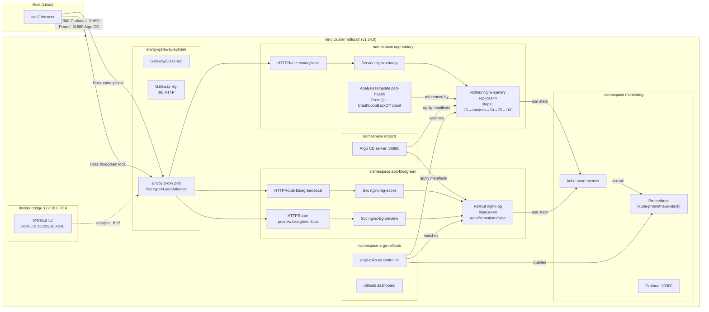

## Progressive delivery on Kind — Argo CD + Argo Rollouts (canary & blue/green) with Envoy Gateway

### Objectives

Stand up a **single-node Kind cluster** that runs a full progressive-delivery
stack and use it to demonstrate **both** deployment strategies side by side:

- A **canary** Rollout (`nginx-canary` in namespace `app-canary`) that
  shifts traffic in weighted steps, runs a **Prometheus-backed
  AnalysisTemplate** against `kube-state-metrics`, and **auto-rolls back**
  when a broken revision is promoted.
- A **blue/green** Rollout (`nginx-bg` in namespace `app-bluegreen`) with a
  separate **preview** Service/Route so you can smoke-test the new colour
  on `preview.bluegreen.local` before manually promoting it.

The sample workload is stock `nginx:1.27-alpine` with the `index.html`
mounted from a ConfigMap — each revision uses a different colour
(`red → green` for canary, `blue → green` for blue/green) so you can
*see* the rollout happen from `curl` or a browser.

### When to use which?

| Strategy       | Good for                                                                 | Price you pay                                                    |
|----------------|--------------------------------------------------------------------------|------------------------------------------------------------------|
| **Canary**     | Continuous delivery of stateless HTTP services where you want real production traffic to vet the new version *gradually*. Lets you catch regressions you can only see under load (latency, error-rate, noisy-neighbour). | A percentage of users hit the new version *before* you're sure it's good — pair it with an AnalysisTemplate + auto-rollback. |
| **Blue/green** | Releases where you need *atomic cutover* and want the old version kept fully warm to roll back instantly — DB schema migrations behind a feature flag, batch workers, anything that can't be half-deployed. | Temporarily 2× the pod/memory footprint. No gradual traffic shaping, so regressions are either 0% or 100%. |

**Argo CD is the *what*. Argo Rollouts is the *how*.** Argo CD watches a Git
repo and applies the manifests to the cluster (declarative GitOps,
drift detection, sync history). It does **not** know about weighted
traffic shifting. When Argo CD applies a `Rollout` CR, the Argo Rollouts
controller reads `strategy.canary` / `strategy.blueGreen` and progresses
the new ReplicaSet step by step, running analyses and aborting on
failure. So: **Argo CD delivers the manifest → Rollouts delivers the
pods.** Use them together.

### Architecture



### Versions

| Component              | Version                |
|------------------------|------------------------|
| Kind                   | v0.31.0                |
| Kubernetes node image  | `kindest/node:v1.34.0` |
| MetalLB (helm)         | 0.15.3                 |
| Gateway API CRDs       | v1.3.0 (standard)      |
| Envoy Gateway          | v1.5.1                 |
| kube-prometheus-stack  | 83.4.2                 |
| Argo CD (helm)         | 9.5.0                  |
| Argo Rollouts (helm)   | 2.40.9                 |
| nginx                  | 1.27-alpine            |

### Prerequisites

- Docker running
- `kind` ≥ 0.31, `kubectl` ≥ 1.34, `helm` ≥ 3.15
- The kind docker network (`172.18.0.0/16` by default) with `.255.200-220` free — the installer checks nothing, so if you already have another MetalLB setup biting this pool, edit `metallb-pool.yaml`.
- Host ports `31300`, `31090`, `31880` free (Grafana, Prometheus, Argo CD NodePorts).

### Reproducing

```bash
chmod +x install.sh test.sh cleanup.sh
./install.sh       # ~6–8 min, idempotent
./test.sh          # smoke tests
```

What `install.sh` does, in order:

1. **Creates the kind cluster** `rollouts` from `kind.yaml` — 1 control-plane + 1 worker, v1.34.0, with host→node port mappings 31300/31090/31880 for the Grafana / Prometheus / Argo CD NodePorts.
2. **Installs MetalLB** via Helm and applies `metallb-pool.yaml` (L2 mode, pool `172.18.255.200-220`).
3. **Applies Gateway API v1.3.0 CRDs** (standard channel) from the upstream release.
4. **Installs Envoy Gateway v1.5.1** from the OCI Helm chart `oci://docker.io/envoyproxy/gateway-helm`, then applies `envoy-gateway.yaml` which creates the `GatewayClass` and a single `Gateway` named `eg` listening on `:80`.
5. **Installs kube-prometheus-stack** with relaxed selectors so any `ServiceMonitor` / `PodMonitor` gets picked up, Grafana on NodePort `30300`, Prometheus on NodePort `30090`, and the upstream Argo Rollouts Grafana dashboard (id 15386) auto-provisioned.
6. **Installs Argo CD** on NodePort `30880` with `--insecure` so the UI is plain HTTP (fine for a local POC).
7. **Installs Argo Rollouts** Helm chart, with the dashboard subchart enabled.
8. **Applies `app-canary.yaml` and `app-bluegreen.yaml`** — Namespaces, ConfigMaps, Services, Rollouts, AnalysisTemplate and HTTPRoutes.

At the end it prints a block with the Gateway LB IP and the UI URLs.

### Access

After `install.sh` finishes:

```bash
GW_IP=$(kubectl -n envoy-gateway-system get svc \
  -l gateway.envoyproxy.io/owning-gateway-name=eg \
  -o jsonpath='{.items[0].status.loadBalancer.ingress[0].ip}')
echo $GW_IP                 # e.g. 172.18.255.200

curl -H 'Host: canary.local'             http://$GW_IP/ | grep -o 'v[0-9]'
curl -H 'Host: bluegreen.local'          http://$GW_IP/ | grep -o 'BLUE\|GREEN'
curl -H 'Host: preview.bluegreen.local'  http://$GW_IP/ | grep -o 'BLUE\|GREEN'
```

UIs (via kind host-port mappings):

- **Grafana**    → <http://localhost:31300>  (admin / admin)
- **Prometheus** → <http://localhost:31090>
- **Argo CD**    → <http://localhost:31880>
  - user `admin`, password:
    `kubectl -n argocd get secret argocd-initial-admin-secret -o jsonpath='{.data.password}' | base64 -d`
- **Rollouts dashboard** (local port-forward):
  `kubectl argo rollouts dashboard -n argo-rollouts` → <http://localhost:3100>

### Demo 1 — Canary with automatic rollback

The canary Rollout starts on revision 1 serving `nginx-v1` (red). Steps:

```text
setWeight 25 → pause 20s → analysis(pod-health) → 50 → pause 20s → 75 → pause 20s → 100
```

It has two safety nets:

- `progressDeadlineSeconds: 60 + progressDeadlineAbort: true` — any stuck
  ReplicaSet (pods not Ready within 60s) triggers an automatic abort.
  Covers **hard failures** (crashes, bad configs, missing images).
- `AnalysisTemplate pod-health` — runs at canary step 2, 4 samples of a
  Prometheus query, fails if any pod in the namespace is in `CrashLoopBackOff`.
  Covers **soft failures** that the pod-Ready signal can't catch, and is
  the hook you'd swap out for a real latency / error-rate / business-metric
  check in production.

> **Why two mechanisms?** The AnalysisTemplate runs *after* `setWeight` has
> completed, and `setWeight` only completes when the canary pods are Ready.
> A pod that crashloops never becomes Ready, so the analysis step would
> never fire. The progressDeadline is what catches that case.

Tip — flip the pod template with `kubectl patch` instead of `sed` so the
source YAML stays canonical:

```bash
flip() { # $1 = configmap name (nginx-v1 | nginx-v2 | nginx-broken)
  kubectl -n app-canary patch rollout nginx-canary --type=json -p "[
    {\"op\":\"replace\",\"path\":\"/spec/template/spec/volumes/0/configMap/name\",\"value\":\"$1\"},
    {\"op\":\"replace\",\"path\":\"/spec/template/spec/volumes/1/configMap/name\",\"value\":\"$1\"}]"
}
```

#### 1.a — Happy path: promote v1 → v2 (green)

```bash
flip nginx-v2
kubectl -n app-canary get rollout nginx-canary -w -o \
  jsonpath='{.status.phase}{" step="}{.status.currentStepIndex}{"\n"}'
```

You will see:

1. A new ReplicaSet is created with 1 replica (weight 25%).
2. `curl -H 'Host: canary.local' http://$GW_IP/` starts returning the green
   page ≈25% of the time (replica-based traffic splitting — with 4 replicas,
   1 canary pod receives roughly 1/4 of the requests through the Service).
3. The `pod-health` AnalysisTemplate runs 4× every 20s querying:
   ```
   sum(kube_pod_container_status_waiting_reason{
       namespace="app-canary",reason="CrashLoopBackOff"}) or vector(0)
   ```
   All samples return 0, analysis passes.
4. Traffic moves to 50%, 75%, 100% and the old ReplicaSet is scaled down.

Loop a curl in another terminal so you can *see* the split live:

```bash
while true; do
  curl -s -H 'Host: canary.local' http://$GW_IP/ | grep -oE 'v[12]'
  sleep 0.2
done
```

#### 1.b — Broken path: auto-rollback (hard failure)

Now promote to the deliberately broken revision. `nginx-broken` has an
invalid `nginx.conf` that makes the container exit immediately →
`CrashLoopBackOff`:

```bash
flip nginx-broken
# watch the phase — expect Progressing → Degraded within ~60s
while :; do
  kubectl -n app-canary get rollout nginx-canary -o jsonpath='{.status.phase}{"\n"}'
  sleep 5
done
```

And, in parallel, loop a curl against the Gateway so you can prove that
**no user ever sees a broken response** — even though 1/4 of the canary
weight was targeting the broken pod, the Service strips out pods that
aren't Ready, so only v2 (green) is served:

```bash
GW=172.18.255.200
while :; do curl -s -H 'Host: canary.local' http://$GW/ | grep -oE 'v[12]|broken'; sleep 0.2; done
```

What the Rollouts controller does:

1. Creates a new ReplicaSet targeting `nginx-broken`, scales it to 1 pod
   (25% of 4). The pod enters `CrashLoopBackOff` within ~10 seconds.
2. Because the canary pod never becomes Ready, `setWeight` never completes
   — the Rollout sits at step 0 with `status.phase=Progressing`.
3. At **t≈60s** the `progressDeadlineSeconds` elapses, Rollouts sets
   `status.abort=true`, scales the broken ReplicaSet back to 0, and the
   Rollout flips to `Degraded`.
4. Traffic continues to flow to the stable ReplicaSet (v2 — green) the
   entire time, because the Service selector only matches Ready pods.

Evidence:

```bash
kubectl -n app-canary get rollout nginx-canary -o jsonpath='{.status.phase}{"\n"}{.status.message}{"\n"}'
# Degraded
# RolloutAborted: Rollout aborted update to revision N

kubectl -n app-canary get rs
# the nginx-broken ReplicaSet is DESIRED=0
```

In the sample run that built this POC, 40/40 curls during the aborted
rollout returned `v2` — zero user impact.

#### 1.c — Soft-failure path (the AnalysisTemplate)

The AnalysisTemplate `pod-health` is wired to step 2 of the canary and
queries kube-state-metrics via Prometheus:

```promql
sum(kube_pod_container_status_waiting_reason{
    namespace="app-canary",reason="CrashLoopBackOff"}) or vector(0)
```

For a *hard* failure the analysis never runs (see above). For a *soft*
failure — think "pod is Ready but returns 500, latency spikes, or a
business KPI drops" — the canary advances past setWeight, pauses, then
runs the analysis. With 4 samples at 20s interval and `failureLimit: 1`,
a single bad sample aborts the rollout.

To prove the analysis fires on the happy path, watch for it during a
v1 → v2 (or v2 → v1) promotion:

```bash
flip nginx-v1
# in another terminal
kubectl -n app-canary get analysisrun -w
# nginx-canary-<hash>-2-2   Running     10s
# nginx-canary-<hash>-2-2   Successful  80s
kubectl -n app-canary get analysisrun -o jsonpath='{.items[-1].status.metricResults}' | jq
```

To recover from a Degraded rollout:

```bash
flip nginx-v2          # (or whichever revision was last known good)
# optional: kubectl argo rollouts retry rollout nginx-canary -n app-canary
```

### Demo 2 — Blue/green with manual promotion

The blue/green Rollout starts on `nginx-blue`. Both `nginx-bg-active`
and `nginx-bg-preview` Services exist; `autoPromotionEnabled: false` so
the new colour sits on the preview Service until you explicitly promote.

```bash
GW=172.18.255.200

flipbg() { # $1 = nginx-blue | nginx-green
  kubectl -n app-bluegreen patch rollout nginx-bg --type=json -p "[
    {\"op\":\"replace\",\"path\":\"/spec/template/spec/volumes/0/configMap/name\",\"value\":\"$1\"},
    {\"op\":\"replace\",\"path\":\"/spec/template/spec/volumes/1/configMap/name\",\"value\":\"$1\"}]"
}

# 1. Before — blue is active
curl -s -H 'Host: bluegreen.local' http://$GW/ | grep -oE 'BLUE|GREEN'    # BLUE

# 2. Flip to green — a new ReplicaSet is created behind the *preview* Service
flipbg nginx-green
while [[ "$(kubectl -n app-bluegreen get rollout nginx-bg -o jsonpath='{.status.phase}')" != "Paused" ]]; do sleep 2; done

# 3. Active still serves blue, preview serves green
curl -s -H 'Host: preview.bluegreen.local' http://$GW/ | grep -oE 'BLUE|GREEN'   # GREEN
curl -s -H 'Host: bluegreen.local'         http://$GW/ | grep -oE 'BLUE|GREEN'   # BLUE

# 4. Promote — atomic cutover; the old ReplicaSet is kept warm for scaleDownDelaySeconds (30s)
kubectl -n app-bluegreen annotate rollout nginx-bg rollout.argoproj.io/promote=true --overwrite
# equivalent (with plugin): kubectl argo rollouts promote nginx-bg -n app-bluegreen
sleep 3
curl -s -H 'Host: bluegreen.local' http://$GW/ | grep -oE 'BLUE|GREEN'           # GREEN

# 5. Emergency undo before the old RS is scaled down
kubectl -n app-bluegreen annotate rollout nginx-bg rollout.argoproj.io/rollback=true --overwrite
# equivalent: kubectl argo rollouts undo nginx-bg -n app-bluegreen
```

Sample output verified on this POC:

```text
-- before: --
BLUE
-- preview GREEN, active BLUE --
GREEN
BLUE
-- after promote --
GREEN
NAME                  DESIRED   CURRENT   READY   AGE
nginx-bg-5d989548bf   2         2         2       13s      # green (new active)
nginx-bg-5f4dd5f459   2         2         2       8m36s    # blue (warm 30s then scaled)
```

### GitOps mode (Argo CD)

`argocd-applications.yaml` contains two `Application` CRs pointing at
`https://github.com/apolzek/tryharding-studies.git` → `content/030`, each
with an `include:` glob so the Application only manages **its** YAML file
(one for the canary demo, one for the blue/green demo).

The installer does **not** apply them by default — the kubectl-apply in
`deploy_apps()` would race with ArgoCD for resource ownership. To switch
to GitOps mode:

```bash
# 1. Commit & push this directory so Argo CD can see it
git add content/030 && git commit -m "add progressive-delivery poc" && git push

# 2. Remove the kubectl-applied copies (they stay in the cluster otherwise)
kubectl delete -f app-canary.yaml
kubectl delete -f app-bluegreen.yaml

# 3. Hand ownership to Argo CD
kubectl apply -f argocd-applications.yaml

# 4. Now promotions = git commits. Edit app-canary.yaml, commit, push, watch Argo CD sync.
```

### Files

```
kind.yaml                          kind cluster config (1 cp + 1 worker, host port maps)
metallb-pool.yaml                  IPAddressPool + L2Advertisement
envoy-gateway.yaml                 GatewayClass + Gateway ':80'
values-kube-prometheus-stack.yaml  kps helm values (NodePorts, kube-state-metrics label allowlist, Rollouts dashboard)
values-argocd.yaml                 argo-cd helm values (NodePort, --insecure, dex off)
app-canary.yaml                    canary Rollout + Svc + HTTPRoute + AnalysisTemplate + 3 ConfigMaps
app-bluegreen.yaml                 blue/green Rollout + active/preview Svc + 2 HTTPRoutes
argocd-applications.yaml           ArgoCD Application CRs (GitOps mode — opt in)
install.sh                         orchestrator (kind → metallb → gwapi → eg → kps → argocd → rollouts → apps)
test.sh                            smoke test (LB IP, HTTP reachability, Prom query, controllers healthy)
cleanup.sh                         kind delete cluster
```

### Cleanup

```bash
./cleanup.sh    # kind delete cluster --name rollouts
```

### References

- Argo Rollouts — <https://argoproj.github.io/argo-rollouts/>
- Argo Rollouts canary spec — <https://argoproj.github.io/argo-rollouts/features/canary/>
- Argo Rollouts blue/green spec — <https://argoproj.github.io/argo-rollouts/features/bluegreen/>
- Argo Rollouts analysis — <https://argoproj.github.io/argo-rollouts/features/analysis/>
- Argo CD — <https://argo-cd.readthedocs.io/>
- Envoy Gateway — <https://gateway.envoyproxy.io/docs/>
- Gateway API — <https://gateway-api.sigs.k8s.io/>
- MetalLB on Kind — <https://kind.sigs.k8s.io/docs/user/loadbalancer/>
- kube-prometheus-stack — <https://github.com/prometheus-community/helm-charts/tree/main/charts/kube-prometheus-stack>
- Grafana dashboard 15386 (Argo Rollouts) — <https://grafana.com/grafana/dashboards/15386>
