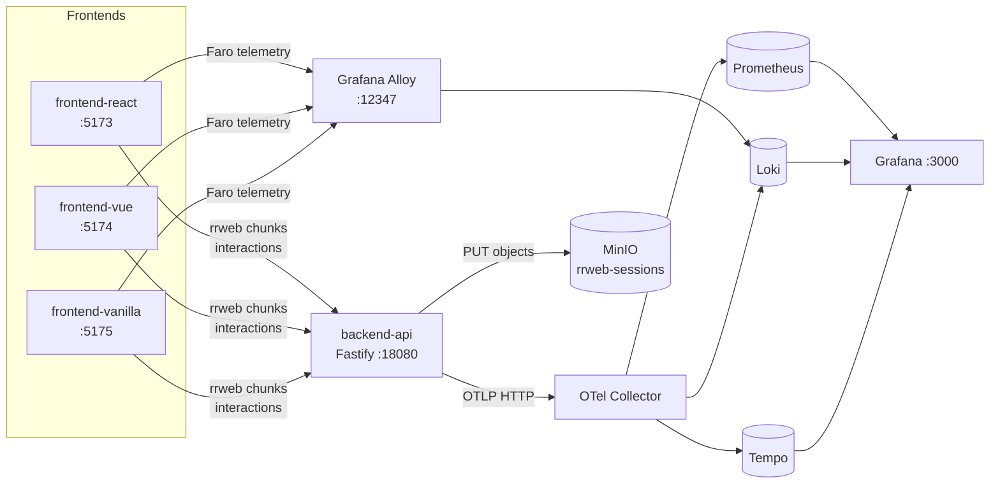

## Frontend observability with rrweb, Faro and OpenTelemetry (React, Vue and Vanilla)

### Objectives

The goal of this PoC is to assemble a full frontend-observability stack that captures real browser signals (traces, logs, metrics and rrweb session recordings) from three equivalent implementations of the same social feed — in **React**, **Vue** and **Vanilla JS** — against a **Node.js/Fastify** backend instrumented with OpenTelemetry. rrweb sessions are shipped in gzipped chunks, persisted in **MinIO** by the backend, and correlated with traces/logs in **Grafana** through **Prometheus**, **Loki** and **Tempo**. **Grafana Alloy** doubles as a Faro-compatible gateway and as an agent to collect container logs.

### Prerequisites

- docker
- docker compose
- make
- Node.js 20+ (only if running `make test` / `make load` locally)

### Architecture



### Services

| Service            | Host port   | Description                                             |
| ------------------ | ----------- | ------------------------------------------------------- |
| frontend-react     | 5173        | Social feed in React + Vite with rrweb + Faro           |
| frontend-vue       | 5174        | Same UX in Vue                                          |
| frontend-vanilla   | 5175        | Same UX in plain JS                                     |
| backend-api        | 18080       | Fastify + Zod + OTel; `/api/feed`, `/api/interactions`, `/api/replay`, `/health` |
| otel-collector     | 24317/24318 | OTLP pipeline → Prometheus / Loki / Tempo               |
| alloy              | 12345 / 12347 | Alloy UI and Faro-compatible endpoint                 |
| prometheus         | 9090        | Metrics + native histograms + exemplars                 |
| loki               | 3100        | Logs                                                    |
| tempo              | 3200        | Traces                                                  |
| grafana            | 3000        | Dashboards (anonymous login as Admin)                   |
| minio              | 9000 / 9001 | Stores rrweb sessions in the `rrweb-sessions` bucket    |

### Reproducing

Bring up the whole stack:
```sh
cd content/031
make up
```

Open any of the frontends (`http://localhost:5173`, `:5174`, `:5175`), navigate the feed and like/comment posts — interactions generate traces on the backend and rrweb sessions are shipped to `/api/replay`.

End-to-end smoke test with Playwright:
```sh
make test
```

Synthetic load with k6:
```sh
make load
```

Tear the stack down (keeping volumes):
```sh
make down
```

Wipe everything (removes volumes):
```sh
make clean
```

### Results

With the stack running:

- **Grafana** (http://localhost:3000) ships provisioned dashboards for backend RED metrics, Faro events and rrweb sessions.
- **MinIO Console** (http://localhost:9001, `minioadmin` / `minioadmin`) shows rrweb chunks persisted at `rrweb-sessions/YYYY/MM/DD/<session>/chunk-XXXX.json.gz`.
- **Tempo** correlates the browser-emitted `trace_id` with the backend span (via the `traceparent` header), enabling navigation from a recorded session to the full backend trace.
- **Prometheus** exposes `http_request_duration_seconds` (native histogram), `interactions_total{type}` and `replay_bytes_total`, among other backend metrics.

The PoC highlights the cost/benefit of shipping rrweb in chunks (high volume but aggressive gzip compression) and how to combine Faro + browser OTel SDK without duplicating telemetry.

### References

```
🔗 https://grafana.com/docs/grafana-cloud/monitor-applications/frontend-observability/
🔗 https://github.com/rrweb-io/rrweb
🔗 https://grafana.com/docs/alloy/latest/
🔗 https://opentelemetry.io/docs/languages/js/
🔗 https://fastify.dev/docs/latest/
🔗 https://min.io/docs/minio/container/index.html
```
