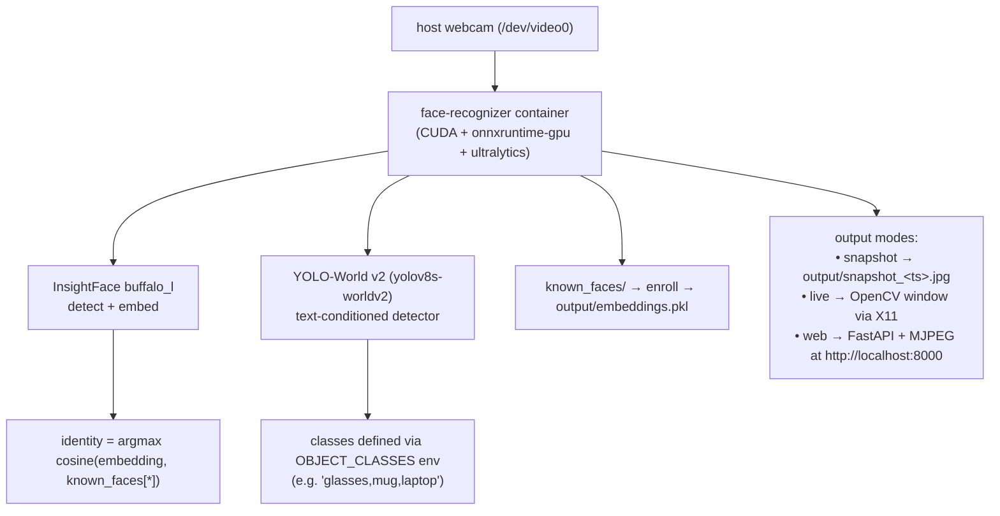

## GPU-accelerated face recognition + open-vocabulary object detection from a webcam

### Objectives

This PoC explores how to do real-time face recognition and open-vocabulary object detection from a local webcam on Ubuntu, using a small set of reference photos as the identity database and a text-conditioned detector for arbitrary object classes. The goal is not to build a production access-control system but to evaluate the developer experience of plugging off-the-shelf stacks — [InsightFace](https://github.com/deepinsight/insightface) (`buffalo_l` on `onnxruntime-gpu`) for faces and [YOLO-World v2](https://docs.ultralytics.com/models/yolo-world/) for objects — into a containerized workflow that owns webcam capture, inference, and result rendering. Four consumption modes are offered: a one-shot **snapshot** (capture one frame, save annotated JPEG), a **live** OpenCV window with bounding boxes and FPS overlay, a **web** UI exposing an MJPEG stream + upload form, and a headless **enroll** for building the identity database.

### Test machine

| Component | Value |
|---|---|
| OS | Ubuntu 24.04.4 LTS (kernel 6.17) |
| CPU | AMD Ryzen 9 7900X (12c / 24t) |
| RAM | 30 GiB |
| GPU | NVIDIA GeForce RTX 4070 Ti SUPER |
| GPU driver | 580.126.09 |
| Docker | 29.4.0 |
| NVIDIA Container Toolkit | 1.19.0 |
| Webcam | integrated / USB at `/dev/video0` |

### Prerequisites

- Ubuntu 22.04+ with a USB/integrated webcam at `/dev/video0`
- NVIDIA GPU with driver ≥ 525 (optional; CPU fallback works)
- Docker + Docker Compose v2
- [NVIDIA Container Toolkit](https://docs.nvidia.com/datacenter/cloud-native/container-toolkit/install-guide.html) (required if you want GPU inside the container)
- `make`
- An X server running on the host (default on Ubuntu desktop) for the `live` OpenCV window

#### Installing the NVIDIA Container Toolkit

If `docker info` does not list `nvidia` under `Runtimes`, install it:

```sh
# 1. Add the NVIDIA repo
curl -fsSL https://nvidia.github.io/libnvidia-container/gpgkey \
  | sudo gpg --dearmor -o /usr/share/keyrings/nvidia-container-toolkit-keyring.gpg

sudo tee /etc/apt/sources.list.d/nvidia-container-toolkit.list > /dev/null <<'EOF'
deb [signed-by=/usr/share/keyrings/nvidia-container-toolkit-keyring.gpg] https://nvidia.github.io/libnvidia-container/stable/deb/amd64 /
EOF

# 2. Install and register the runtime with Docker
sudo apt update && sudo apt install -y nvidia-container-toolkit
sudo nvidia-ctk runtime configure --runtime=docker
sudo systemctl restart docker

# 3. Verify — you should see "nvidia" in the Runtimes list
docker info | grep -i nvidia
```

### Architecture



The container reads frames straight from `/dev/video0`, runs face recognition + object detection on every frame, and produces an annotated output according to the mode. In `web` mode a FastAPI server exposes an MJPEG stream and a form to upload new reference photos — uploads trigger an automatic re-enroll.

### Reproducing

#### 1) Provide reference photos

Drop one image per person into `known_faces/`. The filename (without extension) becomes the displayed name. One face per photo, well-lit, frontal works best:

```
known_faces/
├── alice.jpg
├── bob.png
└── carol.jpg
```

You can skip this step if you plan to use the web UI — uploads via the form are written here automatically.

#### 2) Build the image

```sh
make build
```

First build is ~4–5 GB (CUDA base + onnxruntime-gpu + torch + CLIP text encoder + YOLO-World weights). YOLO models (`yolov8n.pt`, `yolov8s-worldv2.pt`) and the CLIP text encoder are baked into the image during build.

#### 3) Build the face embedding database

```sh
make enroll
```

Runs InsightFace once per file, takes the largest detected face, and writes mean embeddings to `output/embeddings.pkl`. Output looks like:

```
[init] model=buffalo_l providers=['CUDAExecutionProvider', 'CPUExecutionProvider']
[enroll] alice <- alice.jpg
[enroll] bob <- bob.png
[enroll] wrote 2 identities to /data/output/embeddings.pkl
```

Re-run `make enroll` whenever you add or replace photos in `known_faces/`. The `buffalo_l` model (~280 MB) is downloaded into a named Docker volume on first run and reused after that.

#### 4) Test with a single snapshot

```sh
make snapshot
```

Captures one frame, runs recognition, prints matches in the terminal, and writes `output/snapshot_<unix_ts>.jpg` with bounding boxes and labels. Open it with any image viewer:

```sh
xdg-open output/snapshot_*.jpg
```

#### 5) Live recognition window (OpenCV)

```sh
make live
```

The `xhost +local:docker` allowance is included in the target so the container can attach to your X server. Press `q` in the OpenCV window to quit. FPS prints to the terminal every 30 frames.

#### 6) Web UI (recommended)

```sh
make web
```

Opens a FastAPI server on `http://localhost:8000` with:

- Live MJPEG stream with face (green) and object (orange) overlays
- Form to upload a new reference photo (`name` + file) — triggers re-enroll automatically
- List of known identities with delete buttons

Stop with `Ctrl+C` or `make down`. The server runs InsightFace **and** YOLO-World on every frame, so expect lower FPS than `make live` when the GPU path is inactive.

### Configuration

All knobs are environment variables. Override per run, e.g.:

```sh
MATCH_THRESHOLD=0.55 YOLO_CONF=0.25 make web
```

| Variable | Default | Effect |
|---|---|---|
| `MATCH_THRESHOLD` | `0.45` | Cosine similarity required to label a face. Lower → more matches but more false positives. |
| `DET_SIZE` | `640` | InsightFace detection input size. Larger → catches smaller faces, slower. |
| `MODEL_NAME` | `buffalo_l` | InsightFace pack. Try `buffalo_s` if VRAM is tight. |
| `YOLO_MODEL` | `yolov8s-worldv2.pt` | Object detector. Use `yolov8n.pt` for a faster COCO-80 model with no custom classes. |
| `YOLO_CONF` | `0.10` | Confidence threshold for object detections. |
| `YOLO_ENABLED` | `1` | Set to `0` to disable object detection entirely. |
| `OBJECT_CLASSES` | (see below) | Comma-separated list of classes for YOLO-World. Only applied when the model name contains `world`. |

Default `OBJECT_CLASSES`:

```
person, glasses, eyeglasses, sunglasses, cell phone, laptop, bottle, cup,
mug, book, keyboard, mouse, headphones, chair, backpack, monitor, pen,
watch, remote control
```

Example — narrow the vocabulary to what you want on camera:

```sh
OBJECT_CLASSES="glasses,coffee mug,phone,keyboard" make web
```

### GPU vs CPU fallback

InsightFace and YOLO both prefer GPU via `onnxruntime-gpu` / `torch`. On first run you will see errors like:

```
Failed to load library libonnxruntime_providers_cuda.so
  with error: libcublasLt.so.11: cannot open shared object file
Applied providers: ['CPUExecutionProvider']
```

This is a known mismatch: the container ships CUDA 12 but `onnxruntime-gpu 1.18.x` links against the cuBLAS 11 `.so` name. Everything still runs on CPU — expect ~2–5 fps in `web` mode on this machine instead of 30+ fps with GPU. The `CUDAExecutionProvider` line in `[init]` confirms GPU usage when the toolchain matches; fall back is transparent.

### Troubleshooting

- `unknown or invalid runtime name: nvidia` — install the NVIDIA Container Toolkit and run `sudo nvidia-ctk runtime configure --runtime=docker && sudo systemctl restart docker`.
- `cannot open camera /dev/video0` — verify the device exists with `ls /dev/video*` and is not held by another app (`fuser /dev/video0`). Override with `--device /dev/video1` if needed.
- Live window does not appear — confirm `echo $DISPLAY` is set (e.g. `:0` or `:1`) and re-run `xhost +local:docker`.
- All faces show `unknown` — re-check `MATCH_THRESHOLD`, lighting, and that `make enroll` saw the right files.
- `CUDAExecutionProvider` missing in the `[init]` log — see *GPU vs CPU fallback* above.
- `ModuleNotFoundError: No module named 'clip'` — rebuild with `make build`; the image needs OpenAI's CLIP (installed in the Dockerfile).
- YOLO-World detects nothing — confirm `OBJECT_CLASSES` is set to something meaningful for your scene and drop `YOLO_CONF` to `0.05` temporarily to see raw detections.

### Results

InsightFace + onnxruntime-gpu was the path of least resistance for faces: detection and recognition come bundled in `FaceAnalysis`, embeddings are L2-normalized for free, and switching between CUDA and CPU is a provider-list swap rather than a rebuild. Persisting embeddings once and keeping the live loop pure inference keeps I/O off the hot path.

For objects, the default COCO-80 YOLOv8n could not label things I cared about (glasses, mugs, headphones) because those classes do not exist in COCO. YOLO-World v2 solved that via text prompts: `set_classes(["glasses", "mug", ...])` encodes each label with CLIP once, and the detector runs as usual. The cost is the CLIP text encoder and a slightly larger model (~50 MB vs ~6 MB).

The biggest practical gotchas:

- **OpenCV imshow** — `opencv-python-headless` ships without `imshow`, so `make live` silently produced nothing until the full `opencv-python` build replaced it.
- **NVIDIA Container Toolkit** — missing on a fresh Ubuntu, produces `unknown or invalid runtime name: nvidia`. Install steps are above.
- **cuBLAS version mismatch** — `onnxruntime-gpu` links against a CUDA 11 `.so` name; the CUDA 12 base image triggers a silent CPU fallback.
- **YOLO-World needs CLIP** — not a dependency of `ultralytics`, so the Dockerfile installs `git+https://github.com/openai/CLIP.git` explicitly and pre-downloads the weights at build time.

For a headless server, `make snapshot` writing JPEGs to a mounted volume and the `web` MJPEG stream are the equivalent flows when no desktop X server is available.

### References

```
🔗 https://github.com/deepinsight/insightface
🔗 https://github.com/deepinsight/insightface/tree/master/python-package
🔗 https://onnxruntime.ai/docs/execution-providers/CUDA-ExecutionProvider.html
🔗 https://docs.nvidia.com/datacenter/cloud-native/container-toolkit/install-guide.html
🔗 https://docs.ultralytics.com/models/yolo-world/
🔗 https://github.com/openai/CLIP
🔗 https://docs.opencv.org/4.x/dd/d43/tutorial_py_video_display.html
```
