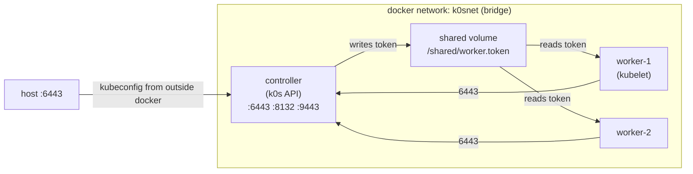

# 037 — k0s PoC in containers (Ubuntu 24.04)

Kubernetes cluster PoC with **k0s** (a lightweight k8s distribution), using **1 control plane + 2 workers**, where each node is a Docker container running a custom Ubuntu 24.04 image. The goal is to validate automation before bringing it up on a VM.

## Layout

```
037/
├── Dockerfile                 # ubuntu:24.04 + k0s + hardening
├── docker-compose.yml         # 1 controller + 2 workers, same network
├── Makefile
├── config/
│   ├── k0s.yaml               # cluster config (apiserver hardening)
│   └── audit-policy.yaml      # apiserver audit policy
├── scripts/
│   ├── install-k0s.sh         # build-time: downloads the k0s binary
│   ├── entrypoint.sh          # runtime: brings up controller or worker
│   └── test-cluster.sh        # host-side: validates nodes and deploys an app
└── manifests/
    └── sample-app.yaml        # PSA namespace + Deployment + PVC + NetworkPolicy
```

## How the containers see each other



- **Token exchange**: the controller issues the worker join token once the apiserver is ready and writes it to `/shared/worker.token` (a named volume mounted **read-only** on the workers). Workers poll until the file shows up.
- **CNI**: `kube-router` (k0s default) in iptables mode.
- **Datastore**: `kine` over SQLite — single-node CP, lightweight. For HA switch to etcd (set `spec.storage.type: etcd` in `config/k0s.yaml`).

## Applied hardening

**Image**
- `ubuntu:24.04` base, only required packages (`iproute2`, `iptables`, `kmod`, `conntrack`, `ethtool`, `socat`, `jq`, `tini`, `ca-certificates`).
- No SSH, no docs, apt caches purged, `/usr/share/{doc,man}` wiped.
- `tini` as PID 1 for proper signal propagation / zombie reaping.
- `k0s.yaml` and `audit-policy.yaml` at `0640`.

**kube-apiserver** (via `spec.api.extraArgs` in `config/k0s.yaml`)
- `anonymous-auth=false`
- `authorization-mode=Node,RBAC`
- `profiling=false`
- `tls-min-version=VersionTLS12`
- Audit log enabled at `/var/log/k0s/audit.log` with rotation.

**kube-controller-manager / scheduler**
- `bind-address=127.0.0.1` (metrics/debug local only)
- `profiling=false`

**Network**
- kube-router CNI with NetworkPolicy enabled.

**Workloads (sample-app)**
- Namespace with **Pod Security Admission** labels (`enforce=baseline`, `warn/audit=restricted`).
- Container runs **non-root** (uid/gid 101, `runAsNonRoot: true`).
- `readOnlyRootFilesystem: true`, `allowPrivilegeEscalation: false`, `capabilities: drop: ["ALL"]`, `seccompProfile: RuntimeDefault`.
- `resources.requests/limits` defined (prevents noisy-neighbour / OOM cascades).
- Image `nginxinc/nginx-unprivileged` (binds to :8080, no root required).
- `NetworkPolicy` default-deny ingress + `allow-web` opening only pod `app=web` port 8080.

## Usage

```bash
make build      # builds the ubuntu+k0s image
make up         # starts controller + 2 workers
make nodes      # kubectl get nodes -o wide
make test       # applies sample-app, waits for rollout and runs a smoke curl
make kubeconfig # exports kubeconfig so you can use kubectl from the host
make down       # stops everything (volumes kept)
make clean      # down -v + removes kubeconfig
```

Host access:

```bash
make kubeconfig
export KUBECONFIG=$PWD/kubeconfig
kubectl get nodes
```

## Disk / storage

### Inside the containers (PoC)

Each node gets named volumes:

| Volume              | Mount            | Purpose                                     |
|---------------------|------------------|---------------------------------------------|
| `controller-data`   | `/var/lib/k0s`   | CP state (kine/SQLite, PKI, manifests)      |
| `controller-log`    | `/var/log/k0s`   | apiserver audit log                         |
| `worker-N-data`     | `/var/lib/k0s`   | kubelet state, CNI, logs                    |
| `worker-N-disk`     | `/mnt/data`      | "Data disk" for hostPath/local PVs          |
| `shared`            | `/shared`        | Join-token exchange                         |

### PV / PVC in the PoC

`manifests/sample-app.yaml` creates a `local`-type `PersistentVolume` pointing to `/mnt/data/demo` on **worker-1**, with `nodeAffinity` pinning the pod to that node. Storage class `local-hostpath` (no provisioner — the volume is created manually, static mode).

Flow:
1. `test-cluster.sh` creates `/mnt/data/demo` inside worker-1 via `docker exec`. On a VM this would be a plain `mkdir` on disk.
2. PV `demo-pv-worker-1` declares `nodeAffinity: worker-1` + `local.path: /mnt/data/demo`.
3. PVC `demo-pvc` (RWO, 1Gi) binds to the PV once the pod is scheduled.
4. Deployment `web` (1 replica, `nodeSelector: worker-1`) mounts the PVC at `/usr/share/nginx/html`. An `initContainer` seeds `index.html` into the PV.
5. Nginx serves content read from worker-1's local disk.

Why `local` and not `hostPath`? `hostPath` doesn't express node affinity and breaks if the scheduler places the pod on a different worker. `local` PV is the recommended way to expose local disk in k8s.

### Production (VM)

On a VM, use a **dedicated disk** for k0s/containerd data:

```bash
# e.g. dedicated /dev/vdb, XFS, mounted with noatime
mkfs.xfs -f -L k0s /dev/vdb
mkdir -p /var/lib/k0s
echo 'LABEL=k0s /var/lib/k0s xfs defaults,noatime,nodiratime 0 2' >> /etc/fstab
mount -a
```

Rationale: `/var/lib/k0s` holds container images, overlayfs layers, pod logs and the datastore (kine/etcd). Sharing a single volume with the root FS means a noisy pod can fill the disk and take the OS down. A separate mount is cheap isolation.

For dynamic in-cluster storage on a VM, options:

- **local-path-provisioner** (Rancher) — creates PVs automatically in a node directory. Simple, good for single-node/edge.
- **Longhorn** / **OpenEBS** — cross-node replication, snapshots.
- **CSI** for your provider (EBS, Ceph-CSI, NFS-CSI) on larger clusters.

For this container PoC, the choice of a static PV makes the mapping `worker-1-disk` ↔ `/mnt/data` ↔ PV explicit.

## "k8s-in-Docker" specific tweaks (DO NOT use on a VM)

To get the cluster running inside Docker, `entrypoint.sh` passes kubelet flags that **only make sense inside a container**:

- `--cgroups-per-qos=false --enforce-node-allocatable=` — disables kubelet's QoS hierarchy management (Burstable/Guaranteed/BestEffort), which clashes with cgroup v2 delegation inside a container.
- `--resolv-conf=/etc/resolv.conf.k0s` — avoids the CoreDNS loop triggered when the container's `/etc/resolv.conf` points to Docker's internal DNS (127.0.0.11), which CoreDNS detects as a loop and exits.
- `cgroup: host` in compose — shares cgroupns with the host (kubelet can create `/sys/fs/cgroup/k8s.io/...` with every controller).

On a real VM, **remove** those flags: kubelet does QoS enforcement correctly, the host resolv.conf has no loops, and cgroupns is not an issue. The `K0S_KUBELET_EXTRA_ARGS` env allows overriding without editing the entrypoint.

## Migrating to a VM

1. Provision a VM with Ubuntu 24.04, 2+ vCPU, 4+ GiB RAM, a separate data disk at `/var/lib/k0s` (see disk section).
2. Copy `config/k0s.yaml` + `config/audit-policy.yaml` to `/etc/k0s/`.
3. `curl -sSfL https://get.k0s.sh | sudo sh` (or copy the binary).
4. Controller: `sudo k0s install controller --config /etc/k0s/k0s.yaml && sudo k0s start`.
5. Worker token: `sudo k0s token create --role=worker --expiry=24h`.
6. On each worker: `sudo k0s install worker --token-file <(echo "<TOKEN>") && sudo k0s start`.
7. Validate: `sudo k0s kubectl get nodes`.

None of the extra kubelet flags is needed.

## Validation (executed in this PoC)

```
$ make up && make test
...
worker-1   Ready    v1.31.2+k0s
worker-2   Ready    v1.31.2+k0s
deployment "web" successfully rolled out
persistentvolumeclaim/demo-pvc   Bound    demo-pv-worker-1   1Gi
attempt 1 -> HTTP 200
cluster OK
```

And the content served comes from worker-1's disk:

```
$ docker exec k0s-worker-1 cat /mnt/data/demo/index.html
hello from k0s on worker-1 PV
```

## Troubleshooting

- `kubectl get pods -n kube-system` showing `CrashLoopBackOff` on coredns → it's the DNS loop. Confirm kubelet is using `--resolv-conf=/etc/resolv.conf.k0s` (check `ps -ef | grep kubelet` inside the worker).
- Workers `NotReady` for too long → `docker logs k0s-worker-1` and look for "cgroup" or "cni". kube-router pulls its image on first run; may take a few minutes.
- Expired token → recreate: `docker exec k0s-controller k0s token create --role=worker > /tmp/t && docker cp /tmp/t k0s-worker-1:/shared/worker.token`.
