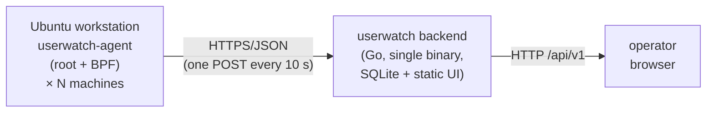

# userwatch

Low-overhead user-productivity monitoring for Ubuntu using **eBPF**. Three
self-contained components:

| Component                         | What it does                                                                 | Stack                               |
|-----------------------------------|------------------------------------------------------------------------------|-------------------------------------|
| [`agent/`](./agent)               | eBPF agent. Counts keyboard, mouse, scroll and TCP bytes in the kernel and flushes aggregated numbers to the backend every N seconds. | Python 3 + BCC (libbpf-compatible)  |
| [`backend/`](./backend)           | Multi-tenant ingestion API, SQLite storage, session/productivity engine, REST API, static frontend server. Single binary, no CGO. | Go 1.22+ (`modernc.org/sqlite`)     |
| [`frontend/`](./frontend)         | Single-page dashboard. Per-user charts, 24 h → 8 h productivity analysis, session history, per-user network split. | Vanilla HTML/CSS/JS + Chart.js      |

The agent runs as a systemd unit on each monitored Ubuntu machine, the backend
runs anywhere reachable by the agents, and the frontend is served by the
backend at `/`.

---

## Why eBPF

The agent does **not** poll X11 events, does **not** tail syslog, and does
**not** read `/dev/input/*` from userspace. Instead, it attaches three BPF
programs directly in the kernel:

| Hook                         | Fires on                                    | Cost per event  |
|------------------------------|---------------------------------------------|-----------------|
| `kprobe:input_handle_event`  | every keypress, mouse click, motion, scroll | 1–2 atomic adds |
| `kprobe:tcp_sendmsg`         | every outbound TCP send                     | 3 atomic adds   |
| `kprobe:tcp_cleanup_rbuf`    | every TCP recv accounting                   | 3 atomic adds   |

Counters live in kernel BPF maps (`BPF_ARRAY` and a per-UID `BPF_HASH`).
Userspace polls them every `UW_INTERVAL` seconds (default 10 s), reads and
resets them atomically, enriches the sample with session/host metadata, and
POSTs one small JSON document.

Steady-state overhead is typically < 0.05 % CPU and < 10 MB RSS on the agent.
The systemd unit hard-caps it at `CPUQuota=20%` and `MemoryMax=256M` anyway.

---

## Metrics collected

Per flush window (default 10 s) the agent reports:

**Input**
- `keys_pressed`, `keys_released` — keyboard events
- `clicks` — mouse button presses
- `mouse_moves` — relative motion events
- `scrolls` — scroll-wheel events

**Network**
- `rx_bytes`, `tx_bytes`, `net_calls` — aggregate TCP I/O
- `per_user_net` — `{uid, user, rx_bytes, tx_bytes, rx_calls, tx_calls}` per UID

**Machine**
- `cpu_used_pct`, `mem_used_pct`, `load1/5/15`, `num_procs`
- `host`, `machine_id`, `kernel`, `os` — host identity

**Session**
- `session_user`, `session_uid` — active graphical session (via `loginctl`)

---

## Productivity model

The backend buckets samples into **1-minute slots** and labels each slot as:

| State     | Meaning                                                   | Counts toward 8 h target? |
|-----------|-----------------------------------------------------------|---------------------------|
| `active`  | ≥ 40 keys/min OR (≥ 2 clicks + ≥ 30 mouse moves /min)     | **yes**                   |
| `light`   | some keys / clicks / motion below active thresholds       | **yes**                   |
| `network` | no input but ≥ 50 KB/min of TCP I/O (call, upload…)       | **yes**                   |
| `idle`    | negligible activity                                       | no                        |

Over a 24 h window the backend then computes:

- **productive_hours** = active + light + network time
- **target_reached_pct** = `productive_hours / 8 h`
- **productivity_score** = 0-100 (70 % target coverage + 30 % interaction intensity)
- **peak_hour**, **hour_breakdown[24]** — which hours carry most of the productivity
- **first_activity_ts / last_activity_ts** — working window

Thresholds and weights are defined in `backend/productivity.go` and can be
tuned without touching the agent.

---

## Quickstart

### 0. Prereqs (Ubuntu 22.04+ / 24.04)

```bash
# For the agent
sudo apt-get install -y bpfcc-tools python3-bpfcc \
    linux-headers-$(uname -r) python3

# For the backend (only if you build it yourself)
# Go 1.22+
```

### 1. Build the backend

```bash
make backend
# produces ./bin/userwatch-backend
```

### 2. Run the backend

```bash
./bin/userwatch-backend \
    --addr :8080 \
    --db   ./userwatch.db \
    --frontend ./frontend
```

Open <http://localhost:8080>. It'll say "no data yet" until an agent reports.

### 3. Run the agent

On every Ubuntu machine you want to monitor:

```bash
sudo UW_BACKEND=http://backend-host:8080 UW_TOKEN=dev-token \
    python3 agent/agent.py --interval 10 -v
```

Or install it as a systemd service:

```bash
sudo ./agent/install.sh
sudo systemctl enable --now userwatch-agent
sudo journalctl -u userwatch-agent -f
```

Edit `/etc/systemd/system/userwatch-agent.service` to point `UW_BACKEND`
and `UW_TOKEN` at your deployment before enabling.

### 4. (Optional) Try it without the agent

```bash
make seed-fake   # or: python3 scripts/seed_fake.py --backend http://127.0.0.1:8080
```

This will POST 24 h of synthetic samples for three users (alice / bob / carol)
so you can explore the UI without running the eBPF agent.

---

## Deployment topology



The backend scales to many agents because each flush is a single ~2 KB POST
and SQLite in WAL mode easily handles hundreds of writes/sec.

---

## HTTP API

| Method | Path                        | Description                                          | Auth  |
|--------|-----------------------------|------------------------------------------------------|-------|
| GET    | `/api/v1/health`            | Liveness                                             | —     |
| POST   | `/api/v1/ingest`            | Agent sample ingestion (JSON body; see `Sample`)     | Bearer|
| GET    | `/api/v1/users`             | All users with session counts + first/last seen      | —     |
| GET    | `/api/v1/sessions?user=&since=` | Sessions, optionally filtered                    | —     |
| GET    | `/api/v1/session/{id}`      | Session detail                                       | —     |
| GET    | `/api/v1/samples?user=&session=&from=&to=` | Raw samples in range                  | —     |
| GET    | `/api/v1/report?user=&from=&to=` | 24 h productivity report (default last 24 h)    | —     |

Bearer token comes from `--token` / `UW_TOKEN` (default `dev-token` — change
for production). Put a reverse proxy (nginx, Caddy, Traefik) in front to add
TLS and authenticate the read APIs to operators.

### Sample schema (agent → backend)

```json
{
  "agent_version": "1.0.0",
  "host": "ws-alice",
  "machine_id": "2bfd…",
  "kernel": "6.8.0-generic",
  "os": "Ubuntu 24.04",
  "session_user": "alice",
  "session_uid": 1001,
  "window_start": 1713360000.0,
  "window_end":   1713360010.0,
  "interval_sec": 10.0,
  "keys_pressed": 47,
  "keys_released": 46,
  "clicks": 3,
  "mouse_moves": 412,
  "scrolls": 0,
  "rx_bytes": 182321,
  "tx_bytes": 51204,
  "net_calls": 28,
  "per_user_net": [{"uid": 1001, "user": "alice", "rx_bytes": 182321, "tx_bytes": 51204, "rx_calls": 18, "tx_calls": 10}],
  "load1": 0.43, "load5": 0.31, "load15": 0.25,
  "mem_used_pct": 48.2, "cpu_used_pct": 7.1, "num_procs": 312
}
```

---

## Security & privacy

- The agent **counts** input and network events; it does **not** capture
  keystroke content, clipboard contents, or packet payloads.
- BPF maps contain only aggregated integer counters and per-UID byte totals.
- Network accounting is TCP-only by default (extendable to UDP via a matching
  pair of kprobes).
- The agent runs with the minimum capabilities it needs
  (`CAP_BPF` + `CAP_PERFMON`, falling back to `CAP_SYS_ADMIN` on older kernels).
- Deploy the backend behind TLS and put an authenticating proxy in front of
  the read APIs for production use.

---

## Repository layout

```
040/
├── agent/
│   ├── bpf_program.c              # kernel-side counters (BCC-compatible)
│   ├── agent.py                   # userspace flusher
│   ├── userwatch-agent.service    # systemd unit
│   └── install.sh                 # installs agent to /opt/userwatch
├── backend/
│   ├── main.go                    # HTTP server, SPA fallback, session reaper
│   ├── api.go                     # REST handlers
│   ├── store.go                   # SQLite schema + queries (session grouping)
│   ├── productivity.go            # bucketing + 24h/8h scoring
│   └── go.mod
├── frontend/
│   ├── index.html                 # dashboard
│   ├── app.js                     # chart logic
│   └── styles.css
├── scripts/
│   ├── seed_fake.py               # seeds synthetic 24h of samples
│   └── seed_fake.sh
├── Makefile
└── README.md
```

---

## Tuning

Thresholds live in `backend/productivity.go`:

```go
ThresholdActiveKeys  = 40        // keys/minute to be "active"
ThresholdLightKeys   = 5
ThresholdClicks      = 2
ThresholdMouseMoves  = 30
ThresholdNetBytesMin = 50_000
ProductiveTargetSec  = 8 * 3600  // <-- 8 h target
ReportWindowSec      = 24 * 3600
```

Restart the backend to apply. Samples are reprocessed on every report request,
so changes take effect immediately for past data.

---

## Troubleshooting

| Symptom                                      | Fix                                                                 |
|---------------------------------------------|---------------------------------------------------------------------|
| `must run as root to load BPF programs`     | `sudo` the agent, or install the systemd unit                       |
| `could not open bpf map: ... Operation not permitted` | Missing `CAP_BPF`/`CAP_PERFMON` — run as root or add capabilities |
| `Failed to compile BPF module` w/ header errors | `sudo apt-get install linux-headers-$(uname -r)`                 |
| UI stays empty                               | Check `journalctl -u userwatch-agent`; confirm backend URL is reachable |
| Sessions look fragmented                     | Lower agent interval, or raise `IdleGap` in `backend/store.go`       |

---

## License

MIT. Build on top, fork, ship.
