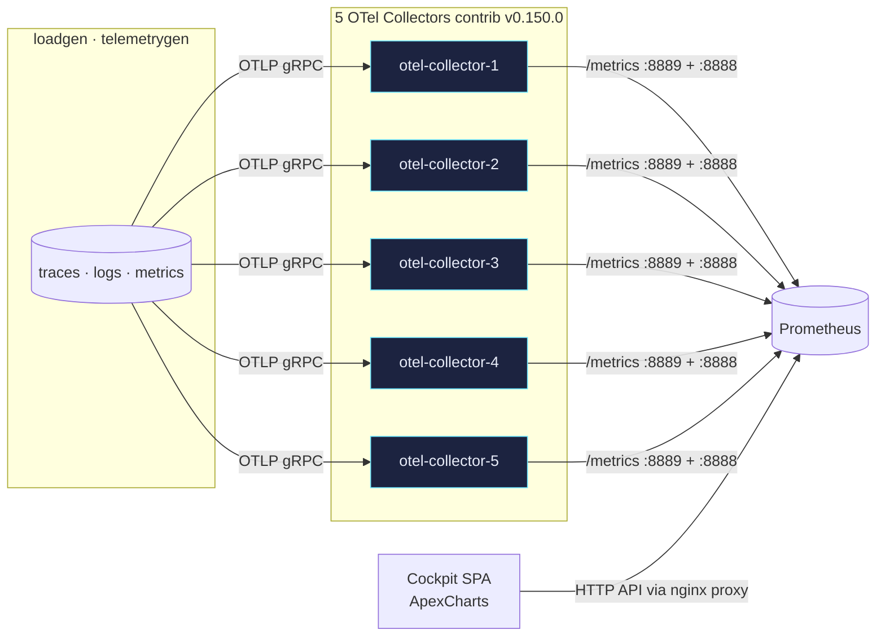

## Cockpit of 5 OpenTelemetry Collectors with Prometheus and a modern web UI

### Objectives

- Run **5 OpenTelemetry Collectors** (contrib `v0.150.x`) in parallel (the `.0` tag was not published to Docker Hub for this series — pinned to `0.150.1`, same minor), each exposed with a different `instance` label for Prometheus.
- Use the **`count` connector** (contrib) to count **spans, span events, logs and datapoints** — sliced by service, severity and error.
- Combine it with other contrib components useful for *statistics & analytics*:
  - `spanmetrics` connector — RED metrics from spans.
  - `servicegraph` connector — topology metrics.
  - `hostmetrics` receiver — CPU / memory / disk / network / processes.
  - `httpcheck` receiver — synthetic monitoring.
  - `resourcedetection` / `transform` processors — enrichment.
- Aggregate all metrics into a single **Prometheus** by scraping the collectors' `:8889` (application) and `:8888` (internal) endpoints directly.
- Build a **modern web cockpit** (nginx + SPA + ApexCharts) that queries the Prometheus **HTTP API** (`/api/v1/query`, `/api/v1/query_range`, `/api/v1/label/<name>/values`) and offers **advanced filters** — by instance, service, severity, time window and refresh interval.



### Prerequisites

- Docker Engine 24+ and Docker Compose v2.
- ~3 GB free disk (otelcol-contrib + prometheus + alpine images).
- Free host ports: `8080` (cockpit), `9091` (Prometheus), `14317/14318/18888/18889` … `54317/54318/58888/58889`.

### Reproducing

```bash
cd content/041
docker compose up -d --build
```

Open the cockpit at [http://localhost:8080](http://localhost:8080). Prometheus is at [http://localhost:9091](http://localhost:9091).

The `loadgen` service uses `telemetrygen` (contrib v0.150.0) to push a mix of traces / logs / metrics to the 5 collectors at different rates — each collector gets a distinct combination so the cockpit curves look clearly differentiated.

Notable metrics produced by the `count` connector (already translated by the Prometheus exporter):

| Metric                               | Source                                 |
|--------------------------------------|----------------------------------------|
| `otelpoc_spans_total`                | count · total spans (includes `service_name` label via resource_to_telemetry_conversion) |
| `otelpoc_spans_errors_total`         | count · only `status.code == 2`        |
| `otelpoc_spanevents_total`           | count · total span events              |
| `otelpoc_logs_total`                 | count · total logs                     |
| `otelpoc_logs_by_severity_total`     | count · logs by `severity_bucket`      |
| `otelpoc_datapoints_total`           | count · metric datapoints              |
| `traces_spanmetrics_*`               | spanmetrics connector                  |
| `traces_service_graph_*`             | servicegraph connector                 |
| `system_*`                           | hostmetrics receiver                   |
| `httpcheck_*`                        | httpcheck receiver                     |
| `otelcol_*`                          | collector internal telemetry           |

### Results

The cockpit (`http://localhost:8080`) shows:

- **KPIs**: spans/s, logs/s, datapoints/s, errors/s, p95 ms, collectors UP.
- **Charts** per instance (`collector-1..5`):
  - stacked area — spans rate;
  - donut — spans/logs/datapoints mix;
  - stacked bar — logs by severity (info/warn/error);
  - line — p95 latency per service (spanmetrics);
  - bar — errors per instance;
  - horizontal bar — top services;
  - line — host CPU;
  - area — host memory;
  - line — exporter queue size;
  - bar — refused + send_failed;
  - heatmap — p95 ms per instance over time;
  - table — consolidated view across all instances.
- **Filters**: per instance (multi-select chips · includes "all"), per service (multi-select), per log severity, per window (5m → 3h) and per refresh (off, 5s, 15s, 30s, 60s).

PromQL queries are built dynamically with Prometheus relabeling labels (`instance=~"..."`) so filters apply across every panel simultaneously.

### References

- OpenTelemetry Collector contrib v0.150.0:
  <https://github.com/open-telemetry/opentelemetry-collector-contrib/releases/tag/v0.150.0>
- Count connector:
  <https://github.com/open-telemetry/opentelemetry-collector-contrib/tree/v0.150.0/connector/countconnector>
- Spanmetrics connector:
  <https://github.com/open-telemetry/opentelemetry-collector-contrib/tree/v0.150.0/connector/spanmetricsconnector>
- Servicegraph connector:
  <https://github.com/open-telemetry/opentelemetry-collector-contrib/tree/v0.150.0/connector/servicegraphconnector>
- Prometheus HTTP API:
  <https://prometheus.io/docs/prometheus/latest/querying/api/>
- ApexCharts: <https://apexcharts.com/docs/>
