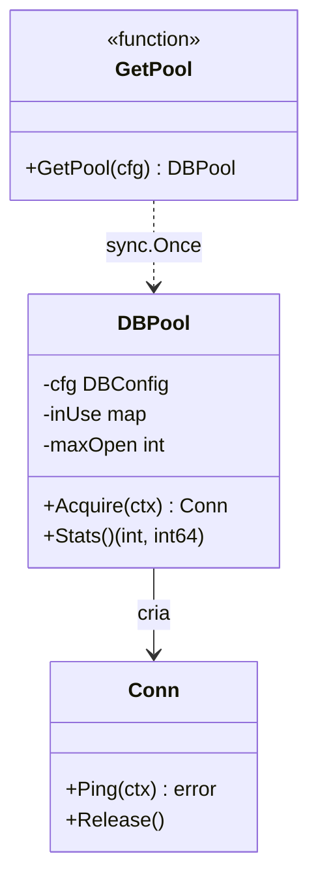

# Singleton

## Problema

Recursos caros como pools de conexão, clientes HTTP e loggers globais devem existir em uma única instância compartilhada pela aplicação. Sem controle, múltiplas inicializações causam vazamento de file descriptors, contenção no banco e estado inconsistente. Além disso, em Go a inicialização precisa ser segura para uso concorrente.

## Solução

O pattern garante uma instância única e thread-safe usando `sync.Once`, que executa a função de inicialização exatamente uma vez mesmo sob múltiplas goroutines.



## Cenário de produção

Pool de conexões com banco de dados acessado por handlers HTTP concorrentes. A primeira chamada a `GetPool` cria o pool; chamadas subsequentes retornam o mesmo ponteiro sem reinicializar.

## Estrutura

- `go.mod`
- `singleton.go` — definição do pool e `GetPool`
- `main.go` — demonstração com goroutines concorrentes
- `singleton_test.go` — testes de concorrência e edge cases

## Como rodar

```bash
cd 042/01-singleton && go run .
```

## Como testar

```bash
go test -race -v ./...
```

## Quando usar

- Recursos caros com custo de inicialização alto (pools, clientes HTTP reutilizáveis).
- Logger ou métrica global com estado compartilhado.
- Cache em memória compartilhado por todo o processo.

## Quando NÃO usar

- Quando a dependência deveria ser injetada para facilitar testes.
- Estado mutável sem sincronização adequada.
- Contextos multi-tenant, onde um singleton vaza dados entre tenants.
- Em bibliotecas reusáveis: obriga o caller a herdar sua decisão global.

## Trade-offs

Prós: garante unicidade, centraliza inicialização cara, simples de consumir.
Contras: dificulta testes unitários (estado global), acopla consumidores ao tipo concreto, pode esconder dependências; requer `resetForTests` ou injeção para contornar em testes.
