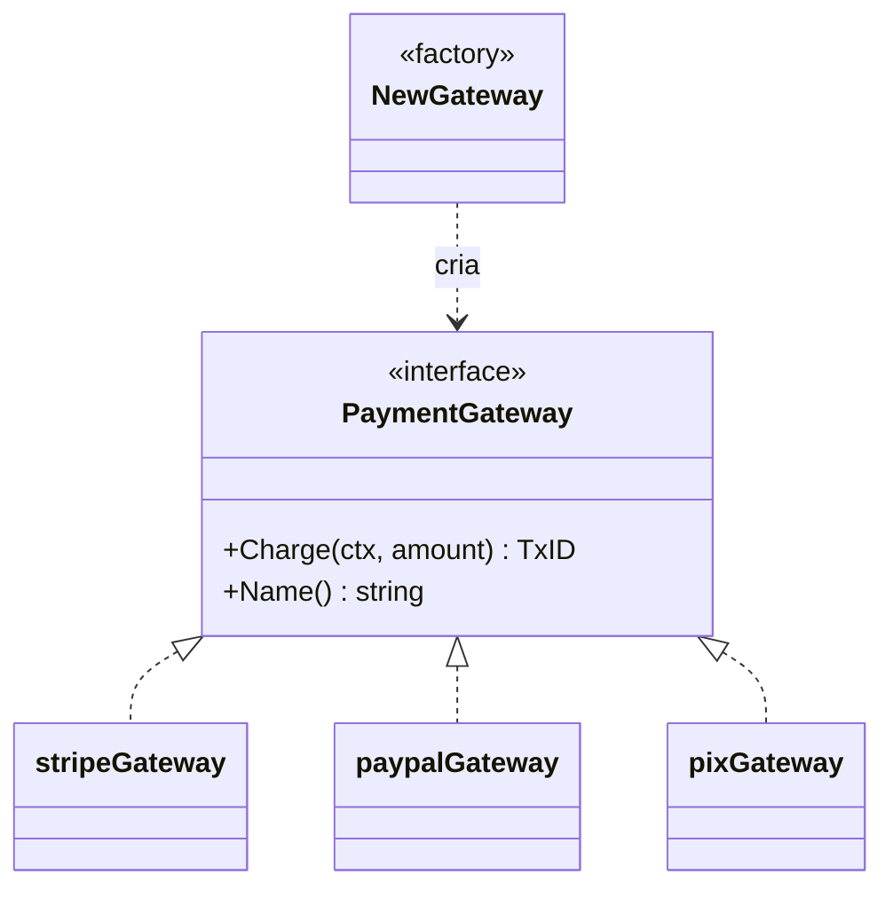

# Factory Method

## Problema

O domínio precisa cobrar o cliente sem conhecer detalhes de Stripe, PayPal ou Pix. Espalhar `if kind == "stripe"` pelo código acopla a lógica de negócio às implementações e torna a adição de novos gateways arriscada. Ainda, cada gateway tem credenciais e erros próprios que não deveriam vazar para o chamador.

## Solução

Expõe uma interface `PaymentGateway` e uma função fábrica `NewGateway(kind, cfg)` que encapsula o `switch` e devolve a implementação correta. O chamador só conhece a interface.



## Cenário de produção

Checkout de e-commerce que suporta Stripe para cartão, PayPal para carteira e Pix para Brasil. O handler escolhe o `Kind` pelo input do usuário e delega a cobrança.

## Estrutura

- `go.mod`
- `factory-method.go` — interface, implementações e `NewGateway`
- `main.go` — demonstração de cobrança em cada gateway
- `factory-method_test.go` — tabela de casos felizes e de erro

## Como rodar

```bash
cd 042/02-factory-method && go run .
```

## Como testar

```bash
go test -race -v ./...
```

## Quando usar

- Quando há várias implementações intercambiáveis de uma mesma operação.
- Quando a criação envolve validação e configuração diferentes por tipo.
- Para isolar o código cliente de dependências externas.

## Quando NÃO usar

- Quando só existe uma única implementação (YAGNI).
- Quando a construção é trivial e uma `struct literal` resolve.
- Quando o tipo concreto é necessário no chamador (perde-se polimorfismo).

## Trade-offs

Prós: desacopla cliente de implementação, centraliza regras de criação, facilita adicionar novos tipos.
Contras: adiciona indireção, a fábrica pode virar um "deus" se cada tipo tiver configuração muito diferente; em Go, cuidado para não reinventar DI.
