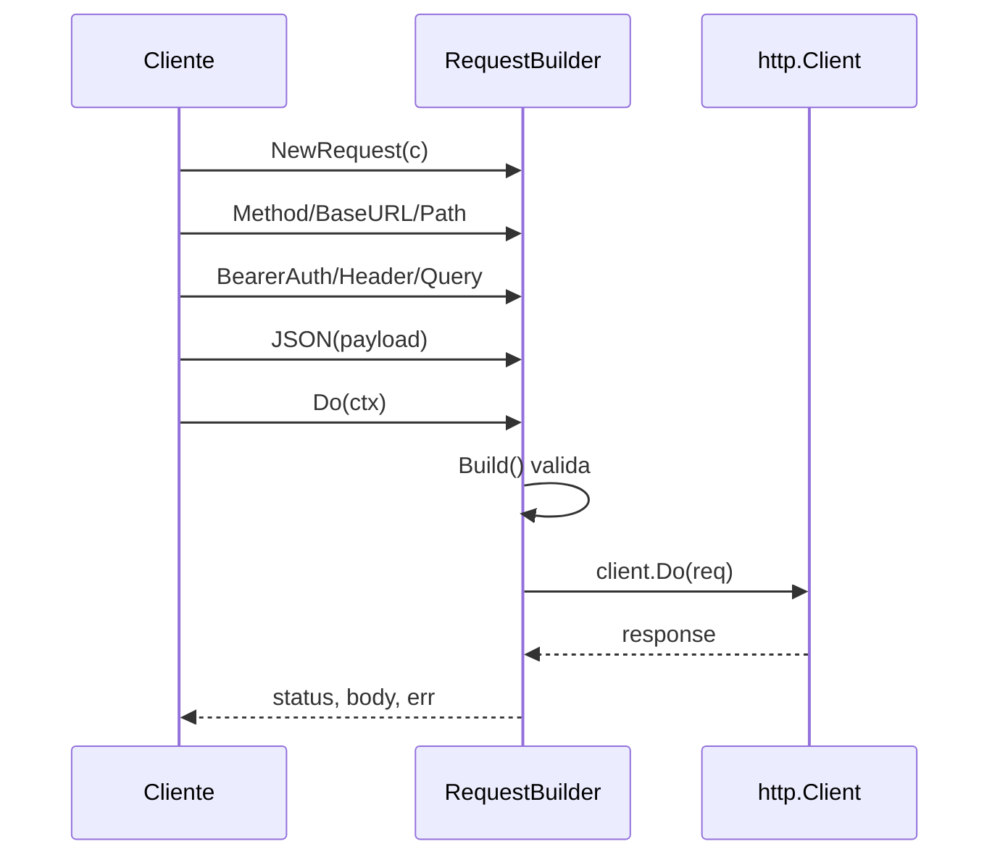

# Builder

## Problema

Construir um `*http.Request` exige muitos passos opcionais: headers, autenticação, query string, body JSON, timeout. Um construtor com muitos parâmetros é ruim de ler e o chamador esquece combinações. Parâmetros inválidos só aparecem em runtime.

## Solução

Um builder com encadeamento fluente acumula configuração e valida tudo em `Build`/`Do`. Cada método devolve o próprio builder, então o código cliente descreve o request como uma receita legível.



## Cenário de produção

Cliente HTTP tipado usado por vários serviços internos. O exemplo executa um request real contra um `httptest.Server` para provar que o builder produz um `*http.Request` funcional.

## Estrutura

- `go.mod`
- `builder.go` — `RequestBuilder` com encadeamento fluente
- `main.go` — demonstra o pattern batendo num servidor em memória
- `builder_test.go` — valida validações, fluxo feliz e timeout real

## Como rodar

```bash
cd 042/04-builder && go run .
```

## Como testar

```bash
go test -race -v ./...
```

## Quando usar

- Objetos com muitos campos opcionais e validação cruzada entre eles.
- APIs públicas onde legibilidade do chamador importa.
- Configuração passo-a-passo onde a ordem de atribuição é flexível.

## Quando NÃO usar

- Structs simples com 2-3 campos (use literal + functional options).
- Objetos imutáveis pequenos onde o construtor básico basta.
- Situações onde o builder é usado concorrentemente — exige sincronização extra.

## Trade-offs

Prós: API fluente legível, centraliza validação, permite builders especializados por caso.
Contras: mais código do que um construtor simples, pode esconder quais campos são obrigatórios, dificulta imutabilidade se o builder for reusado entre threads.
