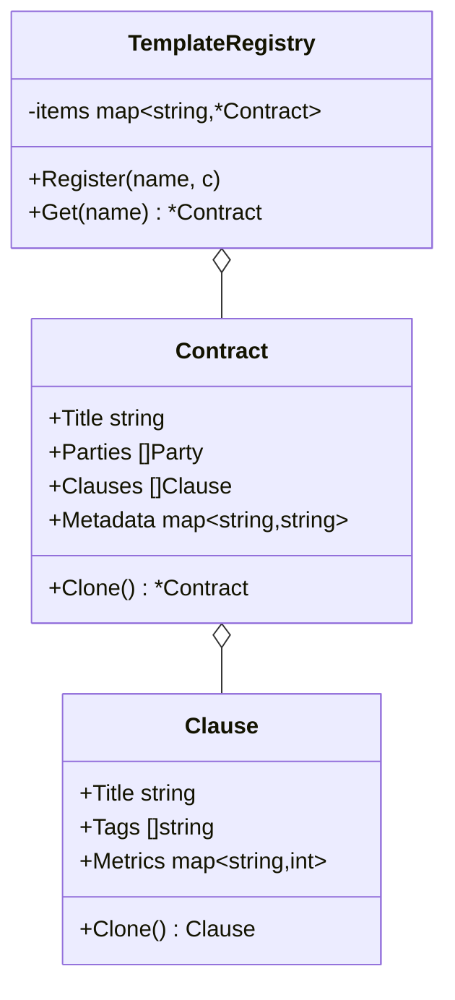

# Prototype

## Problema

Construir objetos complexos do zero — contratos com dezenas de cláusulas, metadados e partes — é caro e propenso a erro. Copiar a struct diretamente (`*a = *b`) compartilha slices e maps internos, então mutar o clone vaza alterações para o original. Precisamos de cópias independentes baratas de criar.

## Solução

Cada tipo exporta um método `Clone` que faz cópia profunda explícita (slices com `append(nil, s...)`, maps copiados entrada por entrada, structs aninhadas delegando para seus próprios `Clone`). Um `TemplateRegistry` guarda protótipos e serve clones sob demanda.



## Cenário de produção

Gerador de contratos de uma legaltech: existe um conjunto de templates (NDA, prestação de serviços, compra e venda). Ao criar um novo contrato para um cliente, parte-se do template e customiza-se partes, metadados e cláusulas sem poluir o protótipo original.

## Estrutura

- `go.mod`
- `prototype.go` — `Contract`, `Clause` e `TemplateRegistry` com DeepCopy
- `main.go` — cria dois contratos a partir do mesmo template
- `prototype_test.go` — valida independência de slices/maps e comportamento do registry

## Como rodar

```bash
cd 042/05-prototype && go run .
```

## Como testar

```bash
go test -race -v ./...
```

## Quando usar

- Objetos caros ou trabalhosos de montar que têm pequenas variações entre instâncias.
- Templates/configurações reutilizadas com customizações pontuais.
- Quando é necessário isolar cópias para evitar mutação compartilhada.

## Quando NÃO usar

- Objetos imutáveis — compartilhar referência é mais barato e seguro.
- Estruturas com recursos externos (file descriptors, conexões) que não devem ser duplicados.
- Grafos cíclicos sem tratamento explícito — o clone ingênuo entra em recursão infinita.

## Trade-offs

Prós: evita construtores gigantes, desacopla o cliente da lógica de criação, cópias independentes previnem mutações indesejadas.
Contras: `Clone` precisa ser mantido em sincronia com o struct (fácil esquecer novo campo), copiar tudo é caro para objetos grandes, e o padrão encoraja esconder relacionamentos com recursos que não deveriam ser duplicados.
