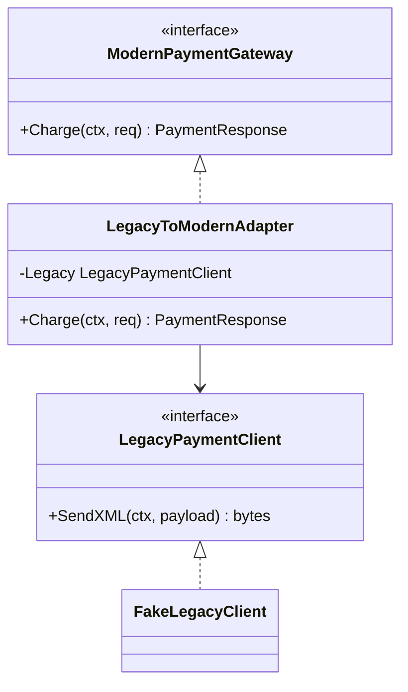

# Adapter

## Problema

Integrar um gateway de pagamento legado (SOAP/XML, valores em centavos) ao domínio moderno que trabalha com REST/JSON e BRL. Mudar o consumidor em cada lugar para falar o protocolo antigo polui a base de código e espalha conhecimento sobre o formato legado. Também dificulta substituir o provedor depois.

## Solução

Criar um adaptador que implementa a interface moderna `ModernPaymentGateway` e, internamente, traduz a chamada para o formato legado.



## Cenário de produção

Sistema novo de checkout precisa cobrar cartões, mas o único processador disponível no país ainda expõe SOAP. O adaptador fica no módulo de infraestrutura; o domínio recebe apenas a interface moderna via injeção de dependência e pode ser testado sem XML nenhum.

## Estrutura

- `go.mod`
- `main.go` — demonstração de cobrança aprovada e negada
- `adapter.go` — interfaces, payloads SOAP e o adaptador
- `adapter_test.go` — testes table-driven

## Como rodar

```bash
cd 042/06-adapter && go run .
```

## Como testar

```bash
go test -race -v ./...
```

## Quando usar

- Integrar com sistemas legados sem reescrevê-los.
- Isolar detalhes de protocolo externo (SOAP, gRPC interno, drivers antigos).
- Permitir testes unitários mockando só a interface moderna.

## Quando NÃO usar

- Se você controla as duas pontas, prefira ajustar a API direto.
- Se a adaptação cresce em regras de negócio, o padrão correto passa a ser Facade ou Anti-Corruption Layer.

## Trade-offs

- Adiciona uma camada extra de tradução (custo de manutenção pequeno, mas real).
- Erros podem ser ofuscados ao cruzar a fronteira de formatos — convém mapear códigos explicitamente.
- Ganha-se testabilidade e troca de provedores sem tocar em chamadas do domínio.
