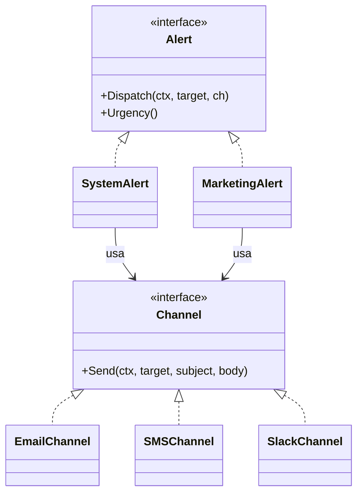

# Bridge

## Problema

Um sistema de notificações precisa enviar vários tipos de alerta (operacional, marketing, etc.) por vários canais (Email, SMS, Slack). Se cada combinação virar uma classe, o código explode em N x M implementações. Além disso, adicionar um novo canal obriga a alterar todos os tipos de alerta.

## Solução

Separar a hierarquia de abstrações (tipos de Alert) da hierarquia de implementações (canais). O alerta carrega a regra de composição de subject/body e delega o envio ao Channel via interface.



## Cenário de produção

Plataforma SaaS onde SREs configuram regras: "alertas críticos do serviço X vão para Slack #ops-crit e Email on-call; alertas de marketing vão por SMS". Tipos de alerta e canais evoluem em ritmos diferentes, e queremos combinar livremente.

## Estrutura

- `go.mod`
- `main.go` — demonstra alerta crítico em Slack+Email e campanha via SMS
- `bridge.go` — interfaces Alert e Channel + implementações
- `bridge_test.go` — testes table-driven cobrindo todos os canais

## Como rodar

```bash
cd 042/07-bridge && go run .
```

## Como testar

```bash
go test -race -v ./...
```

## Quando usar

- Quando há duas dimensões que variam independentemente.
- Quando novos canais ou novos tipos entram com frequência.
- Para testar um lado (alertas) mockando o outro (canais).

## Quando NÃO usar

- Se só existe uma dimensão de variação, basta uma interface simples.
- Se tipos e canais são poucos e estáveis, herança/funções chegam.

## Trade-offs

- Mais interfaces e indireção — ganho de flexibilidade tem custo cognitivo.
- A regra de "qual canal para qual alerta" migra para quem orquestra (config/roteador), não para o código.
- Facilita injeção de dependência e testes isolados.
