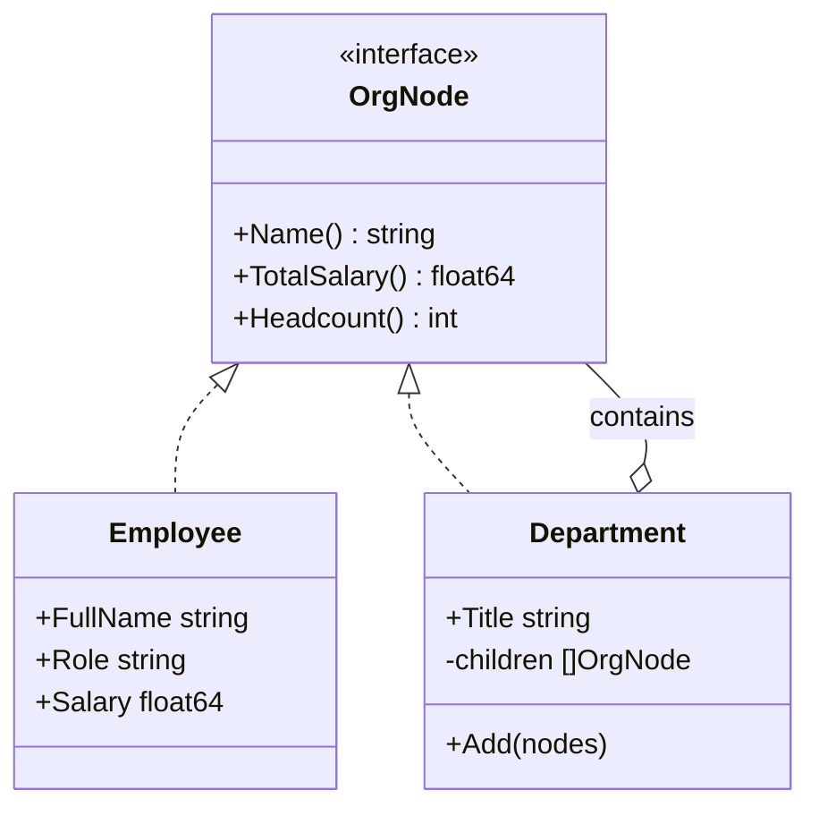

# Composite

## Problema

Representar um organograma corporativo com departamentos aninhados e funcionários, e rodar cálculos (folha de pagamento, headcount, média salarial) sem precisar fazer type switches entre "é departamento?" / "é pessoa?" no código cliente.

## Solução

Tratar folhas (Employee) e composições (Department) sob uma mesma interface `OrgNode`. Departamentos agregam filhos e implementam os cálculos somando as respostas dos filhos. O cliente usa a árvore de forma uniforme.



## Cenário de produção

Sistema de RH que importa o organograma de uma empresa com múltiplos níveis (empresa, áreas, squads, pessoas). Folha, headcount por área e média salarial por nível precisam ser calculados e exibidos em um dashboard.

## Estrutura

- `go.mod`
- `main.go` — monta uma ACME com Engenharia/Backend/Frontend e imprime a árvore
- `composite.go` — interface OrgNode, Employee, Department
- `composite_test.go` — testes cobrindo folha, composição vazia e aninhada

## Como rodar

```bash
cd 042/08-composite && go run .
```

## Como testar

```bash
go test -race -v ./...
```

## Quando usar

- Estruturas em árvore (organogramas, menus, filesystem, ASTs) onde folhas e nós compostos devem responder à mesma interface.
- Quando operações agregadas são naturais (soma, busca, render).

## Quando NÃO usar

- Quando a distinção entre folha e composição gera regras muito diferentes.
- Quando a árvore é rasa e fixa — um slice simples resolve.

## Trade-offs

- Operações que só fazem sentido em folha (ex.: "ajustar salário") ficam estranhas na interface comum. Resolve-se com type assertion pontual ou interfaces auxiliares.
- Ciclos na árvore são perigosos; o `Add` aqui bloqueia self-reference, mas grafos mais complexos exigem verificação explícita.
- Caminhos de leitura ficam muito simples e recursivos.
