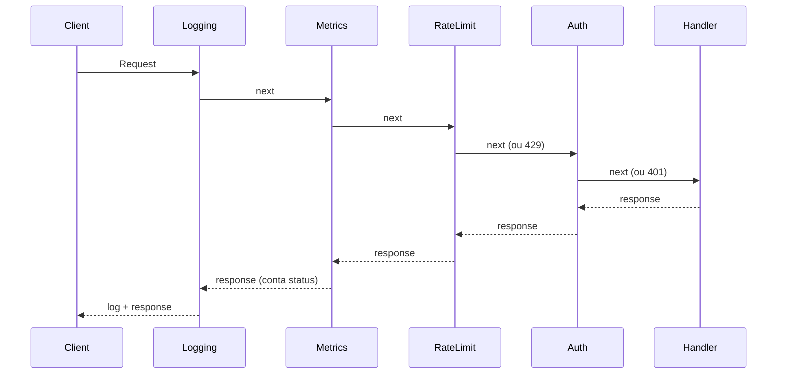

# Decorator

## Problema

Adicionar comportamento transversal (logging, auth, rate-limit, métricas) a handlers HTTP sem acoplar essas responsabilidades dentro de cada handler. Misturar tudo no handler viola SRP e dificulta testes.

## Solução

Cada responsabilidade vira um middleware — uma função que recebe e retorna `http.Handler`. O `Chain` compõe os middlewares na ordem desejada. O handler final fica trivial e cada decorator é testado isoladamente.



## Cenário de produção

API pública com tokens Bearer, rate-limit para defender o backend, métricas para observabilidade e logs estruturados para troubleshooting. Precisamos aplicar tudo isso sem poluir a lógica de negócio dos handlers.

## Estrutura

- `go.mod`
- `main.go` — monta uma cadeia e bate nela com `httptest.NewServer`
- `decorator.go` — tipo Middleware, Chain, Logging, Auth, RateLimit, Metrics
- `decorator_test.go` — testes cobrindo cada middleware e a composição

## Como rodar

```bash
cd 042/09-decorator && go run .
```

## Como testar

```bash
go test -race -v ./...
```

## Quando usar

- Comportamentos transversais aplicáveis a muitos endpoints.
- Quando quer ligar/desligar funcionalidades via configuração (compor listas de middleware).
- Para aderir ao idioma de Go (`func(http.Handler) http.Handler`).

## Quando NÃO usar

- Quando o comportamento depende de regras do próprio handler; melhor deixar dentro dele.
- Quando a cadeia cresce demais e esconde fluxo — considere um framework com grupos/rotas.

## Trade-offs

- A ordem importa: auth antes de log vs. depois muda o que é observado.
- Cada middleware pode alocar (ex.: `responseRecorder`); medir antes de otimizar.
- Grande ganho em reuso e testabilidade; pequeno custo de indireção.
