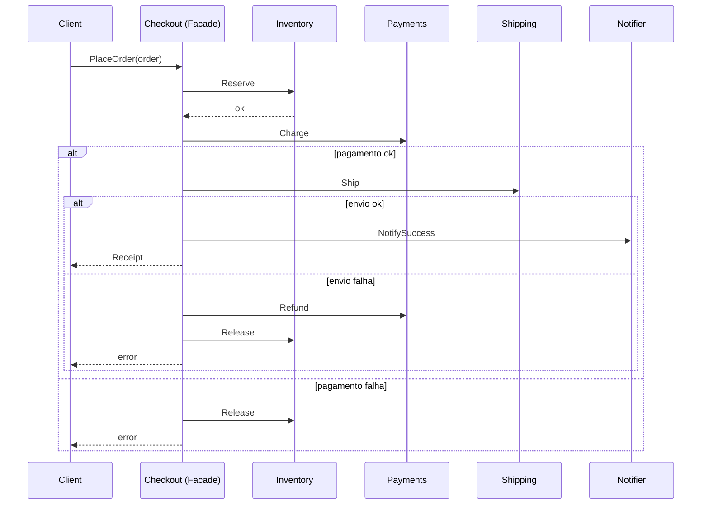

# Facade

## Problema

Colocar um pedido envolve quatro subsistemas (estoque, pagamento, envio, notificação), cada um com sua própria API, ordem de chamada e regras de compensação em caso de falha. Deixar os clientes (HTTP handlers, jobs, CLI) orquestrarem tudo espalha conhecimento e convida bugs.

## Solução

Criar uma fachada `Checkout` com um único método `PlaceOrder(ctx, order)`. Ela conhece a ordem das operações e compensa passos já executados quando um posterior falha.



## Cenário de produção

Endpoint HTTP `POST /orders` recebe um pedido validado e chama `checkout.PlaceOrder`. Se amanhã trocarmos o provedor de pagamento ou adicionarmos um passo de antifraude, só a fachada muda — nem o handler nem o resto do código.

## Estrutura

- `go.mod`
- `main.go` — executa um pedido feliz e um pedido que falha no pagamento
- `facade.go` — interfaces dos subsistemas, fachada Checkout e fakes
- `facade_test.go` — testes cobrindo happy path, falhas e compensações

## Como rodar

```bash
cd 042/10-facade && go run .
```

## Como testar

```bash
go test -race -v ./...
```

## Quando usar

- Quando vários subsistemas precisam ser orquestrados em uma mesma operação de negócio.
- Para esconder detalhes de rollback/compensação atrás de uma API estável.
- Como ponto de entrada de camada de aplicação em arquitetura hexagonal.

## Quando NÃO usar

- Se há uma chamada 1:1 sem orquestração, basta usar o subsistema direto.
- Se a "fachada" só delega sem adicionar regra nem ordem, é código morto.

## Trade-offs

- A fachada acumula responsabilidade — é preciso cuidado para não virar um "god object".
- Simplifica o caller, mas esconde detalhes que às vezes ele precisa (retries específicos, parcial). Para isso, exponha sub-APIs quando necessário.
- Saga de compensação aqui é in-memory; produção exige durabilidade (ex.: workflow engine).
