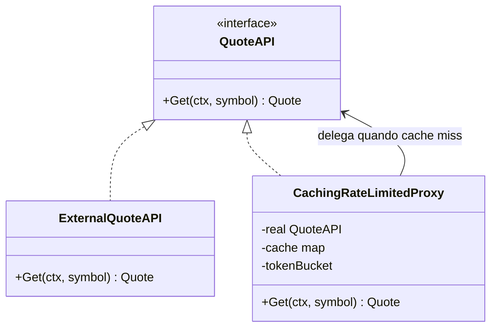

# Proxy

## Problema

Uma API externa de cotações é lenta, cara por chamada e tem rate-limit severo. Chamá-la a cada consulta do cliente estoura o limite e degrada a latência. Espalhar código de cache pelos chamadores é ruim porque viola o princípio do DRY e expõe um detalhe de infraestrutura.

## Solução

Um proxy que implementa a mesma interface `QuoteAPI` do real subject e adiciona, transparentemente, cache TTL em memória e token bucket como rate-limit local. O código cliente não muda: ele recebe `QuoteAPI` e não sabe se é o real ou o proxy.



## Cenário de produção

Serviço de painel financeiro que mostra cotações de ações. A API upstream cobra por chamada e limita 10 req/s. Com o proxy na frente, a maioria das consultas é servida do cache (TTL de alguns segundos) e o rate-limit local protege o upstream contra picos.

## Estrutura

- `go.mod`
- `main.go` — faz 5 consultas seguidas e imprime o contador do upstream
- `proxy.go` — interface QuoteAPI, real subject e proxy com cache + rate-limit
- `proxy_test.go` — testes de cache hit/expiração, rate-limit, concorrência

## Como rodar

```bash
cd 042/11-proxy && go run .
```

## Como testar

```bash
go test -race -v ./...
```

## Quando usar

- Cachear respostas idempotentes e caras.
- Adicionar controle de acesso, logging ou auditoria em frente de um objeto.
- Representação remota (RPC client) que se comporta como o objeto local.

## Quando NÃO usar

- Quando a latência do real subject já é mínima e o cache adiciona complexidade sem ganho.
- Quando os dados mudam com frequência e TTL curto degenera em cache miss sempre.

## Trade-offs

- Stale-while-revalidate exige cuidado: aqui a primeira chamada após expirar paga a latência do upstream.
- Cache em memória é invisível entre réplicas; produção frequentemente usa Redis ou similar.
- Ganho claro em vazão e custo; custo adicional em concorrência e invalidação correta.
