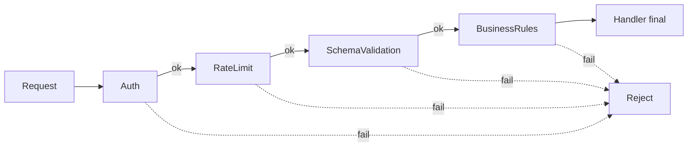

# Chain of Responsibility

## Problema

Em um servidor HTTP, cada requisicao precisa passar por varias verificacoes
(autenticacao, rate-limit, validacao de schema, regras de negocio). Centralizar
tudo num unico handler cria acoplamento, dificulta testes isolados e impede
reordenar ou desligar etapas dinamicamente.

## Solucao

Cada etapa e um handler independente que decide se processa e encaminha ou
interrompe a cadeia com erro. A composicao e feita na borda, permitindo
reutilizacao e teste unitario.



## Cenario de producao

API de pagamentos onde cada request `/pay` deve: validar token JWT, respeitar
quota por IP, conferir campos obrigatorios do body e bloquear valores acima de
um teto configurado por cliente.

## Estrutura

- `chain_of_responsibility.go` — handlers e builder do pipeline
- `main.go` — demonstracao com 4 requests (valido, token invalido, body incompleto, valor acima do teto)
- `chain_of_responsibility_test.go` — tabela de casos + teste de rate limit e cancelamento de contexto
- `go.mod`

## Como rodar

```bash
cd 042/12-chain-of-responsibility && go run .
```

## Como testar

```bash
go test -race -v ./...
```

## Quando usar

- Multiplas etapas sequenciais e independentes
- Possibilidade de adicionar/remover etapas em runtime
- Etapas de cross-cutting (log, auth, validacao)

## Quando NAO usar

- Fluxo rigido com 1-2 validacoes simples
- Necessidade forte de execucao paralela das etapas
- Quando as etapas dependem fortemente umas das outras via estado compartilhado

## Trade-offs

- Prol: baixo acoplamento, ordem configuravel, testes unitarios simples
- Contra: indirecao extra ao debugar, risco de erro em "esquecer de chamar next", overhead de ponteiros
