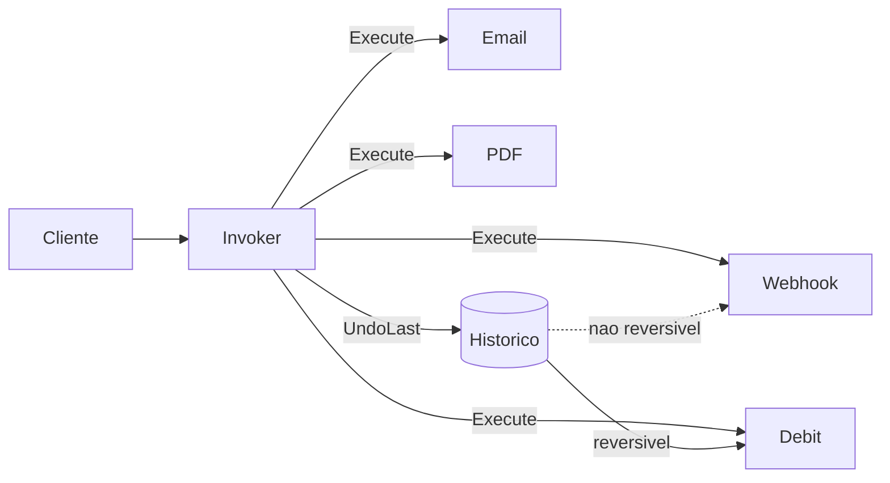

# Command

## Problema

Um sistema precisa enfileirar operacoes heterogeneas (email, PDF, webhook,
transferencias financeiras), desacoplar quem pede da implementacao, manter
historico e permitir undo em operacoes reversiveis sem acoplar a logica de
desfazer ao chamador.

## Solucao

Cada operacao e encapsulada como `Command` com `Execute` e `Undo`. Um `Invoker`
mantem historico e implementa a politica de desfazer pulando comandos
nao-reversiveis.



## Cenario de producao

Processador de fila assincrona em um backoffice bancario: enfileira envio de
notificacao, geracao de fatura e webhook para o parceiro. Em caso de estorno,
apenas a operacao de debito e revertida (credit), ignorando comandos
colaterais ja materializados.

## Estrutura

- `command.go` — interface Command, comandos concretos, Account e Invoker
- `main.go` — demo com fila mista e undo do ultimo reversivel
- `command_test.go` — table-driven dos comandos, undo e historia vazia
- `go.mod`

## Como rodar

```bash
cd 042/13-command && go run .
```

## Como testar

```bash
go test -race -v ./...
```

## Quando usar

- Enfileirar operacoes heterogeneas com mesma interface
- Necessidade de undo/redo ou log de auditoria
- Agendar, postergar ou distribuir execucao de tarefas

## Quando NAO usar

- Operacao unica e sincrona sem necessidade de historico
- Custo de manter estado de undo nao vale (ex.: operacoes externas irreversiveis majoritarias)

## Trade-offs

- Prol: desacopla cliente/executor, favorece fila/retry, habilita undo
- Contra: mais tipos/objetos, risco de vazar estado mutavel no comando, undo nem sempre e possivel
