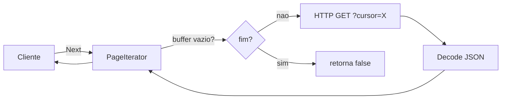

# Iterator

## Problema

Consumir uma API paginada com cursor exige que o cliente gerencie estado
(cursor atual, buffer, fim de dados). Espalhar essa logica pelo codigo de
negocio polui a base e dificulta testes com `httptest`.

## Solucao

Um iterator encapsula o cursor e busca paginas sob demanda. O cliente apenas
chama `Next` ate receber `false`, e consulta `Err` ao final.



## Cenario de producao

Cliente de uma API REST de listagem de pedidos com cursor (`next_cursor`).
O codigo de negocio itera pedidos sem saber de paginacao, HTTP ou JSON.

## Estrutura

- `iterator.go` — tipos Item/pageResponse e PageIterator
- `main.go` — demo com httptest simulando 3 paginas
- `iterator_test.go` — tabela com multi-page, single, empty e casos de erro/ctx
- `go.mod`

## Como rodar

```bash
cd 042/14-iterator && go run .
```

## Como testar

```bash
go test -race -v ./...
```

## Quando usar

- API com pagina grande, cursor, ou lazy-loading remoto
- Esconder detalhes de transporte do consumidor
- Permitir streaming sem carregar tudo em memoria

## Quando NAO usar

- Conjunto pequeno que cabe numa chamada
- Quando o consumidor precisa processar em paralelo (use channels/workers)

## Trade-offs

- Prol: esconde paginacao, uso simples, facil de testar com httptest
- Contra: estado mutavel interno, tratamento de erro em dois pontos (Next + Err), dificil rebobinar
