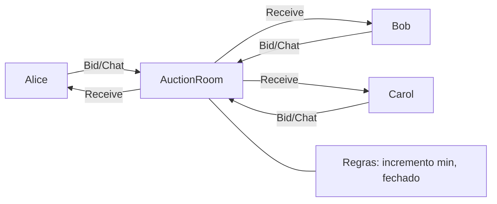

# Mediator

## Problema

Numa sala de leilao online, cada participante precisaria conhecer todos os
outros para enviar mensagens e lances. Isso gera acoplamento N-para-N, duplica
regras (incremento minimo, leilao fechado) e torna testes dificeis.

## Solucao

Um mediador (`AuctionRoom`) concentra o roteamento e as regras. Participantes
so conhecem a sala; a sala conhece os participantes e aplica a politica.



## Cenario de producao

Sala de leilao em tempo real onde clientes fazem lances concorrentes. O
mediador valida cada lance (acima do atual + incremento), anuncia vencedor ao
fechar e distribui mensagens de chat sem exposicao direta entre participantes.

## Estrutura

- `mediator.go` — AuctionRoom, Bidder, regras de negocio e thread-safety
- `main.go` — demo com 3 bidders, broadcast, lances e fechamento
- `mediator_test.go` — tabela para join, bids (validos/invalidos/fechado) e broadcast
- `go.mod`

## Como rodar

```bash
cd 042/15-mediator && go run .
```

## Como testar

```bash
go test -race -v ./...
```

## Quando usar

- Comunicacao N-para-N com regras compartilhadas
- Necessidade de aplicar politicas centralizadas (auth, quorum, ordem)
- Facilitar testes do fluxo em um unico ponto

## Quando NAO usar

- Comunicacao ponto-a-ponto simples (interface direta resolve)
- Quando o mediador vira "god object" e escala horizontal e requerida

## Trade-offs

- Prol: desacopla participantes, concentra regras, testes previsiveis
- Contra: mediador pode crescer demais; ponto unico de bloqueio em sistemas muito concorridos
