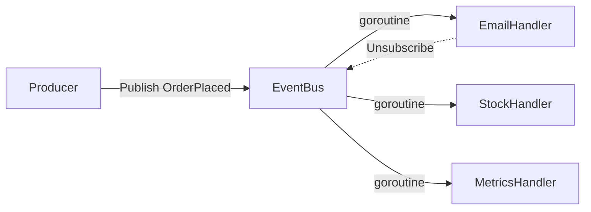

# Observer

## Problema

Ao criar um pedido, varios subsistemas precisam reagir (envio de email,
reserva de estoque, atualizacao de metricas). Chamar cada um diretamente
acopla o produtor aos consumidores, dificulta adicionar novos e impede
execucao paralela.

## Solucao

Um barramento de eventos in-memory registra handlers por tipo de evento e os
invoca de forma assincrona (goroutine por handler). Assinaturas sao
canceladas via `Unsubscribe`. Mapa protegido por `sync.RWMutex`; termino
observavel com `Wait`.



## Cenario de producao

Servico de checkout publica `OrderPlaced` num bus interno. Handlers
independentes tratam notificacao, reserva de estoque e ingestao de metricas.
Adicionar um novo handler nao exige tocar o produtor.

## Estrutura

- `observer.go` — EventBus, Subscription, entrega assincrona thread-safe
- `main.go` — demo com 3 subscribers e unsubscribe
- `observer_test.go` — tabela de entrega, unsubscribe, concorrencia (32 workers x 100 msgs), ctx cancelado
- `go.mod`

## Como rodar

```bash
cd 042/16-observer && go run .
```

## Como testar

```bash
go test -race -v ./...
```

## Quando usar

- Fan-out de eventos para multiplos consumidores independentes
- Desacoplar producer de consumers em um mesmo processo
- Adicionar/remover consumidores em runtime

## Quando NAO usar

- Precisa de garantia de entrega, retry ou persistencia (use broker real)
- Dependencia forte de ordem total entre handlers
- Ciclos de vida que exigem backpressure rigorosa

## Trade-offs

- Prol: desacoplamento, extensibilidade, paralelismo natural
- Contra: sem entrega garantida, erros em handlers nao propagam ao publisher, depuracao de ordem e dificil
