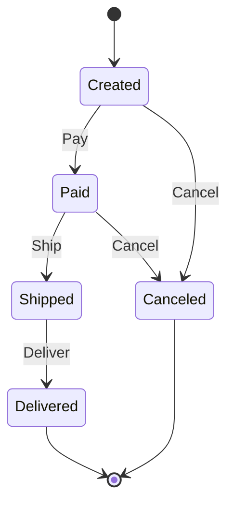

# State

## Problema

Um pedido de e-commerce percorre vários estados (criado, pago, enviado, entregue, cancelado) e cada um habilita um conjunto distinto de operações. Concentrar essas regras em `if/switch` espalhados pelo código produz um emaranhado difícil de evoluir e de testar, além de abrir espaço para transições ilegais como "entregar antes de enviar".

## Solução

Encapsular cada estado em um tipo próprio que implementa a interface `OrderState`. O `Order` mantém uma referência ao estado atual e delega as ações a ele; cada estado decide o que é válido e qual será o próximo estado.



## Cenário de produção

Serviço de pedidos de um marketplace precisa aplicar regras diferentes por estado: billing só pode estornar enquanto o pedido estiver `Paid`, logística só aceita `Ship` a partir de `Paid`, atendimento não pode cancelar pedidos já despachados. Centralizar a máquina de estados num único módulo elimina divergências entre times.

## Estrutura

- `state.go` — interface `OrderState`, contexto `Order` e estados concretos.
- `main.go` — demonstração com transições válidas e inválidas.
- `state_test.go` — tabela cobrindo fluxo feliz, cancelamentos e transições proibidas.

## Como rodar

```
cd 042/17-state && go run .
```

## Como testar

```
go test -race -v ./...
```

## Quando usar

- Objeto possui um ciclo de vida bem definido com regras por estado.
- Várias ações cujo comportamento depende do estado atual.
- Você quer detectar transições inválidas explicitamente.

## Quando NÃO usar

- Só existem dois estados e uma única decisão boolean. Um campo já resolve.
- Regras de negócio mudam por cliente/tenant, não por estado do objeto.
- Estados raramente mudam e o custo de abstração é maior que o benefício.

## Trade-offs

- Elimina `switch` gigante em troca de mais tipos no pacote.
- Cada transição fica testável isoladamente.
- Adicionar um novo estado pode exigir ajustar todos os estados existentes para negar a ação.
