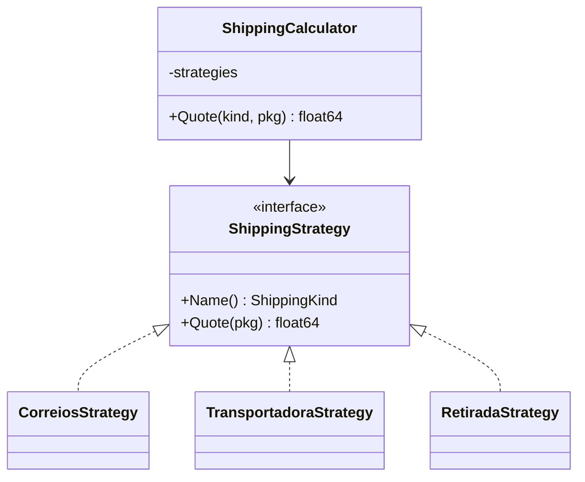

# Strategy

## Problema

O cálculo de frete do checkout combina várias fórmulas — Correios aplica piso mínimo, transportadora cobra uma taxa base, retirada em loja é grátis. Implementar tudo com `if/switch` torna o código pouco testável e complica a inclusão de novos modais (ex.: drone, bicicleta).

## Solução

Definir uma interface `ShippingStrategy` e um tipo concreto para cada modalidade. Um `ShippingCalculator` injeta as estratégias disponíveis e seleciona em runtime pelo tipo escolhido no pedido.



## Cenário de produção

No checkout, o frontend envia peso, distância e modalidade preferida. O backend aplica a estratégia correspondente sem conhecer a fórmula de cada transportadora, permitindo que contratos comerciais sejam ajustados sem mexer na lógica do pedido.

## Estrutura

- `strategy.go` — interface, estratégias concretas e `ShippingCalculator`.
- `main.go` — demonstração cotando as três modalidades.
- `strategy_test.go` — tabela validando cada estratégia e erros.

## Como rodar

```
cd 042/18-strategy && go run .
```

## Como testar

```
go test -race -v ./...
```

## Quando usar

- Vários algoritmos cumprem o mesmo contrato e são escolhidos em runtime.
- Você quer isolar regras de negócio variáveis e testá-las separadamente.
- Novas variações aparecem com frequência.

## Quando NÃO usar

- Existe apenas um algoritmo e ele nunca muda.
- As diferenças são pequenas e cabem em parâmetros de uma função.
- Overhead de interface é crítico num hot path muito sensível.

## Trade-offs

- Mais tipos e arquivos, porém substituíveis sem afetar quem chama.
- Facilita injeção em testes (basta passar um mock implementando a interface).
- O registro precisa ser populado; esquecer uma estratégia só é detectado em runtime.
