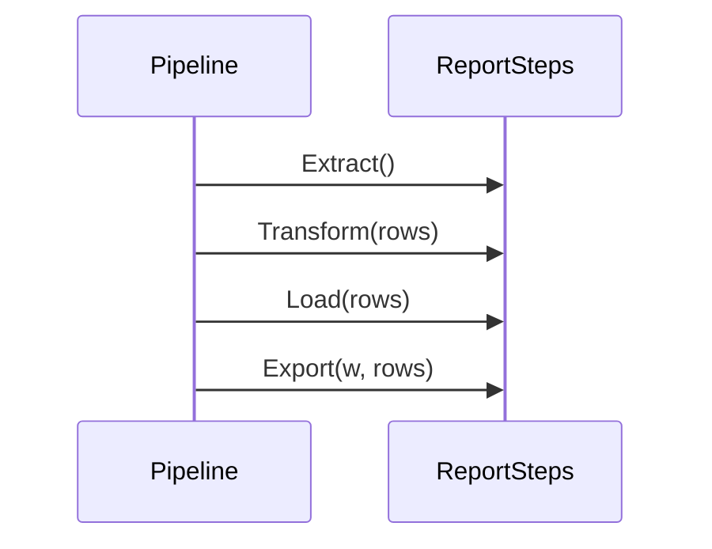

# Template Method

## Problema

Gerar relatórios em formatos diferentes (CSV, JSON, PDF) passa por etapas muito parecidas: extrair dados, transformar, persistir e serializar. Copiar o fluxo para cada formato produz código duplicado e regressões quando a ordem muda — por exemplo, alguém esquece de filtrar valores inválidos antes de exportar.

## Solução

Definir um esqueleto fixo no `ReportPipeline.Run` (template method) e expor as etapas via interface `ReportSteps`. Os formatos concretos herdam o comportamento comum por composição (`baseReport`) e sobrescrevem apenas os passos que divergem.



## Cenário de produção

Plataforma de analytics precisa entregar o mesmo dataset em CSV para planilhas, JSON para uma API interna e PDF para diretoria. Centralizar o fluxo garante que novas regras (como remover amount<=0) sejam aplicadas em todos os formatos sem retrabalho.

## Estrutura

- `template-method.go` — `ReportPipeline`, interface `ReportSteps`, `baseReport` e formatos concretos.
- `main.go` — executa o pipeline nos três formatos.
- `template-method_test.go` — tabela validando filtragem, ordenação, arredondamento e envelope PDF.

## Como rodar

```
cd 042/19-template-method && go run .
```

## Como testar

```
go test -race -v ./...
```

## Quando usar

- Vários fluxos compartilham a mesma sequência de etapas.
- Só algumas etapas variam entre as implementações.
- Ordem de execução é crítica e precisa ser fixada no framework.

## Quando NÃO usar

- As etapas mudam de ordem entre casos — prefira Strategy ou composição funcional.
- Há apenas uma implementação concreta; o template vira over-engineering.
- Você precisa variar grande número de passos; Strategy ou Pipeline explícito podem ser mais claros.

## Trade-offs

- Garante ordem e pontos de extensão explícitos, mas esconde o fluxo atrás de uma interface.
- Reaproveitamento via embedding (`baseReport`) é idiomático em Go.
- Evolução acoplada: mudar uma etapa obriga revisar todos os formatos que a sobrescrevem.
