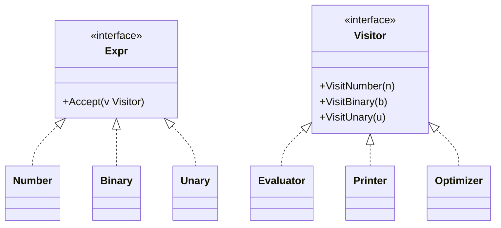

# Visitor

## Problema

A AST de um interpretador aritmético tem nós estáveis (números, operações), mas as operações feitas sobre ela mudam com frequência — avaliar, imprimir, otimizar, gerar código. Se cada nó carregar métodos para todas essas operações, qualquer funcionalidade nova obriga editar todos os tipos de nó.

## Solução

Separar a estrutura dos algoritmos. Cada nó expõe `Accept(Visitor)` e a interface `Visitor` declara um método por tipo de nó. Novas operações viram novos visitors sem tocar na AST.



## Cenário de produção

Compiladores, linters e motores de regras operam sobre ASTs. Um visitor executa, outro produz representação textual, outro aplica simplificações antes de gerar código. Todos compartilham a mesma árvore sem se interferir.

## Estrutura

- `visitor.go` — interfaces `Expr`/`Visitor`, nós (`Number`, `Binary`, `Unary`) e visitors (`Evaluator`, `Printer`, `Optimizer`).
- `main.go` — demonstração com otimização + avaliação.
- `visitor_test.go` — tabelas validando avaliação, impressão e regras de otimização.

## Como rodar

```
cd 042/20-visitor && go run .
```

## Como testar

```
go test -race -v ./...
```

## Quando usar

- Hierarquia de tipos estável e algoritmos que crescem com frequência.
- Algoritmos precisam de acesso uniforme a toda a árvore/estrutura.
- Quer separar lógica de percurso da lógica de processamento.

## Quando NÃO usar

- Os tipos de nó mudam muito; cada novo nó força revisão em todos os visitors.
- Você só tem uma operação — um type switch direto é mais simples.
- Alto custo de alocação por nó em caminhos muito sensíveis a performance.

## Trade-offs

- Novos comportamentos sem alterar nós, porém novos nós obrigam tocar todos os visitors (double dispatch).
- Em Go, o retorno `any` do método Visit exige coerção; tipos genéricos mitigariam.
- Visitors imutáveis (como o Optimizer) permitem encadear transformações sem efeitos colaterais.
