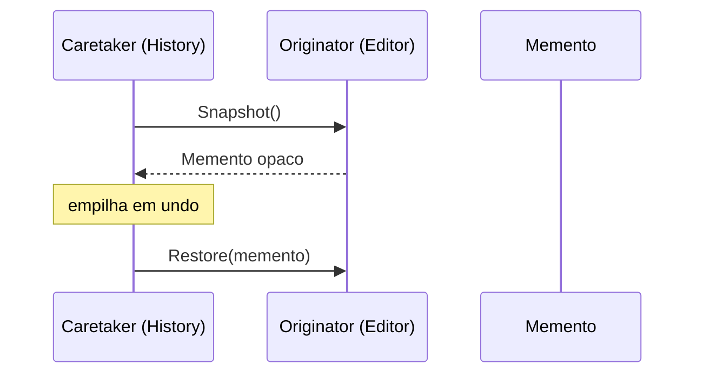

# Memento

## Problema

Um editor de texto (ou de configuração) precisa suportar undo/redo. Expor os campos internos para que outro componente os manipule quebra o encapsulamento; forçar o próprio editor a manter o histórico mistura duas responsabilidades distintas.

## Solução

Separar os papéis em três peças: o Originator (`Editor`) sabe criar e restaurar snapshots; o Memento guarda o estado de forma opaca; o Caretaker (`History`) apenas empilha mementos e decide quando aplicar undo/redo, sem inspecionar seu conteúdo.



## Cenário de produção

Editores de código, formulários complexos, editores visuais e configuradores hierárquicos usam esse padrão para permitir Ctrl+Z/Ctrl+Y. O Caretaker pode aplicar políticas (limite de memória, deduplicação) sem acoplar-se ao formato interno do estado.

## Estrutura

- `memento.go` — `Editor` (Originator), `Memento` e `History` (Caretaker) com limite configurável.
- `main.go` — demonstração de edição, undo/redo e descarte de redos após nova escrita.
- `memento_test.go` — tabela cobrindo edição, undo/redo, histórico vazio, limite e restore.

## Como rodar

```
cd 042/21-memento && go run .
```

## Como testar

```
go test -race -v ./...
```

## Quando usar

- Precisa de undo/redo ou rollback transacional.
- Quer isolar o estado salvo do código que gerencia o histórico.
- O estado é pequeno o bastante para ser copiado com frequência.

## Quando NÃO usar

- Estado enorme — copiar tudo a cada mudança é proibitivo (considere CRDTs ou diffs).
- Operações são facilmente invertíveis por comando (prefira Command + Undo por inverso).
- O histórico precisa ser persistente entre processos (event sourcing costuma ser melhor).

## Trade-offs

- Mantém encapsulamento: o Caretaker nunca lê o conteúdo do Memento.
- Cópia defensiva do estado pode ser cara; limite da pilha ajuda a controlar memória.
- Snapshots independentes facilitam time-travel debugging e testes de regressão.
