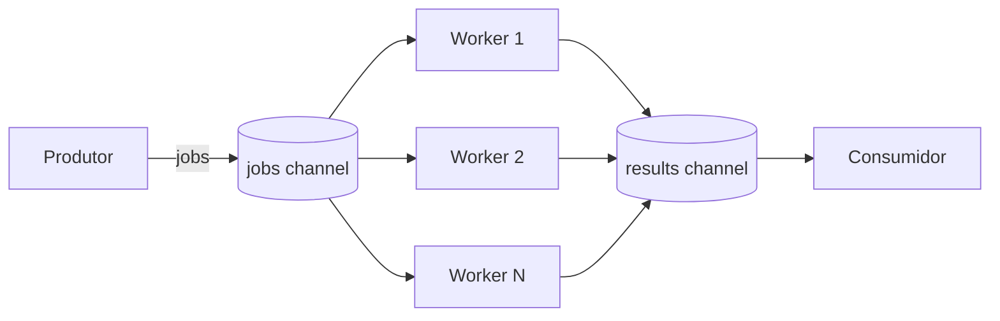

# Worker Pool

## Problema

Você precisa processar uma grande quantidade de tarefas (ex.: redimensionar imagens, processar linhas de log, enviar notificações) sem explodir em goroutines e sem serializar o trabalho. Criar uma goroutine por job é simples, mas perde controle sobre uso de CPU, memória e conexões com recursos externos.

## Solução

Um número fixo de workers (`N`) consome jobs de um canal de entrada e publica resultados em um canal de saída. O ciclo de vida é controlado por `context.Context` e `sync.WaitGroup` para garantir shutdown limpo sem vazamento de goroutines.



## Cenário de produção

Serviço de ingestão que recebe milhares de logs por segundo e precisa parsear, enriquecer e encaminhar para um backend. Um pool de 8 a 16 workers processa em paralelo respeitando o throughput do sistema downstream e permitindo shutdown gracioso ao receber SIGTERM.

## Estrutura

- `worker_pool.go` — tipos `Pool`, `Job`, `Result` e ciclo de vida (Start/Submit/Stop).
- `main.go` — demonstração: produtor envia 10 jobs, 4 workers consomem.
- `worker_pool_test.go` — testes de corretude, erro, shutdown e concorrência.

## Como rodar

```bash
cd 042/22-worker-pool && go run .
```

## Como testar

```bash
go test -race -v ./...
```

## Quando usar

- Volume alto de tarefas curtas independentes.
- Limite explícito de paralelismo (CPUs, conexões, rate limit).
- Necessidade de backpressure natural via canal.

## Quando NÃO usar

- Poucas tarefas esporádicas (overhead desnecessário).
- Tarefas com fortes dependências entre si (prefira pipeline).
- Processamento streaming com estágios lógicos distintos (use pipeline).

## Trade-offs

- Complexidade extra para shutdown limpo, mas ganho em estabilidade de recursos.
- Canais buferizados amortizam picos, porém aumentam latência percebida e uso de memória.
- Número fixo de workers exige ajuste fino por ambiente; pode virar gargalo se mal dimensionado.
