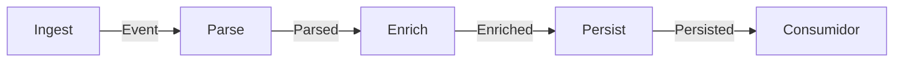

# Pipeline

## Problema

Processamento em várias etapas sequenciais onde cada etapa tem responsabilidade clara (ingerir, parsear, enriquecer, persistir). Acoplar tudo numa função gigante prejudica testabilidade e desperdiça paralelismo: enquanto um estágio espera I/O, o próximo poderia estar processando outros elementos.

## Solução

Cada estágio roda em sua própria goroutine e se comunica com o próximo via canal. Canais fechados propagam o fim do fluxo naturalmente, e `context.Context` carrega cancelamento fim-a-fim, permitindo interromper o pipeline inteiro a partir de qualquer estágio.



## Cenário de produção

ETL de eventos de negócio: microserviço lê do broker (Kafka), parseia JSON, enriquece com dados do cache de usuários, aplica regras de fraude e grava em data warehouse. Cada estágio escala independente e pode ser isolado para debugging/metrics.

## Estrutura

- `pipeline.go` — estágios `Ingest`, `Parse`, `Enrich`, `Persist`.
- `main.go` — demonstração encadeando todos os estágios.
- `pipeline_test.go` — testes de corretude, cancelamento e entrada vazia.

## Como rodar

```bash
cd 042/23-pipeline && go run .
```

## Como testar

```bash
go test -race -v ./...
```

## Quando usar

- Fluxo linear com etapas bem definidas e desacopláveis.
- Quando cada etapa tem custo/latência diferente e pode se beneficiar de paralelismo natural.
- Streaming de dados onde o volume total é desconhecido ou infinito.

## Quando NÃO usar

- Lógica com muitas ramificações condicionais (vira spaghetti de canais).
- Transformações triviais sem I/O (overhead das goroutines não compensa).
- Processamento em lote onde se pode resolver com um loop simples.

## Trade-offs

- Cada estágio é uma goroutine e um canal extra: simples de testar mas cada novo estágio é mais um ponto de vazamento se mal escrito.
- Backpressure é implícito: se um estágio fica lento, todos os anteriores bloqueiam.
- Debug requer cuidado: um panic em um estágio fecha aquele canal; estágios anteriores precisam respeitar `ctx.Done()`.
