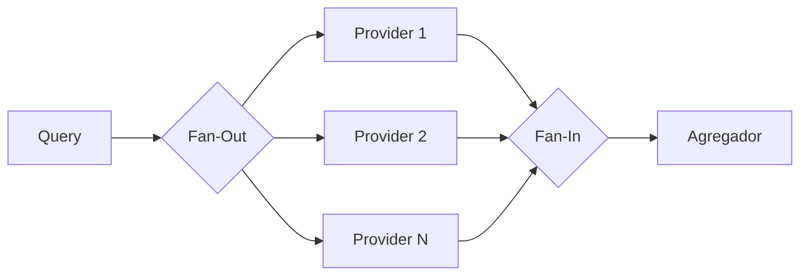

# Fan-Out / Fan-In

## Problema

Você precisa consultar várias fontes de dados em paralelo (múltiplos provedores, APIs, shards) e consolidar as respostas em um único fluxo. Fazer chamadas sequenciais soma latências; cada fonte pode falhar de forma independente sem derrubar o agregado.

## Solução

Fan-out: para cada fonte, dispara uma goroutine que escreve em um canal próprio. Fan-in: multiplexa todos esses canais em um único canal de saída usando `sync.WaitGroup` para saber quando fechar. `context.Context` cancela tudo em caso de timeout ou falha global.



## Cenário de produção

Agregador de cotações que consulta 5 corretoras em paralelo para escolher a melhor taxa. Cada corretora responde em tempos diferentes; a ausência/erro de uma não deve atrapalhar a decisão com as demais. Timeout global garante SLA.

## Estrutura

- `fan_out_fan_in.go` — `fanOut`, `fanIn`, `Aggregate`, `BestPrice`.
- `main.go` — demonstração com 4 brokers fictícios (um deles falhando).
- `fan_out_fan_in_test.go` — testes de agregação, erros parciais, cancelamento e best-price.

## Como rodar

```bash
cd 042/24-fan-out-fan-in && go run .
```

## Como testar

```bash
go test -race -v ./...
```

## Quando usar

- Várias fontes independentes e idempotentes (consultas, caches, réplicas).
- Necessidade de responder em tempo aproximado ao mais lento tolerável.
- Quando falhas parciais são aceitáveis.

## Quando NÃO usar

- Fonte única (sem paralelismo a explorar).
- Respostas interdependentes (ordem ou estado compartilhado).
- Quando qualquer erro deve abortar tudo (use `errgroup` ou similar).

## Trade-offs

- Multiplica I/O e uso de conexões: custo externo real que precisa de budget.
- Fan-in é simples, mas exige cuidado com o fechamento do canal agregado (um WaitGroup esquecido = deadlock).
- Erros são coletados, não propagados: a lógica de decisão (ex.: `BestPrice`) precisa lidar com falhas parciais explicitamente.
