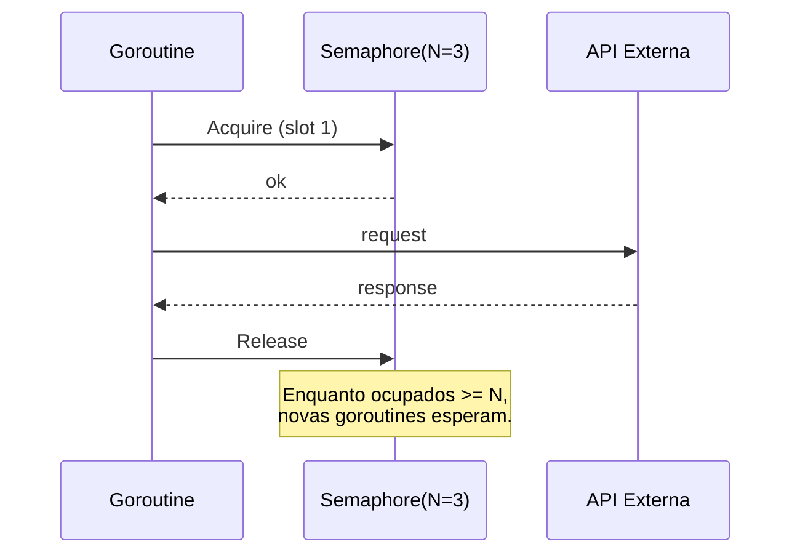

# Semaphore

## Problema

Você precisa chamar uma API externa (ou qualquer recurso limitado) a partir de muitas goroutines, mas o provedor impõe um limite de requisições simultâneas (ex.: N=10). Sem controle, goroutines disparam em massa e tomam 429/503 ou estouram connection pool. Não se quer serializar tudo; apenas limitar a concorrência a N.

## Solução

Um semáforo contador implementado com canal buferizado de capacidade N. `Acquire` envia um token ao canal (bloqueia se cheio), `Release` retira um. Goroutines continuam escalando livremente; o gargalo é explícito e controlável. `context.Context` permite desistir da espera.



## Cenário de produção

Worker de enriquecimento que precisa chamar uma API de CEP/CNPJ com quota de 5 req/s concorrentes. Centenas de eventos pendentes entram, mas no máximo 5 estão em flight. Cancelamento via context permite drenar rápido em shutdown.

## Estrutura

- `semaphore.go` — `Semaphore` e helper `LimitedRun`.
- `main.go` — 12 chamadas com limite de 3 concorrentes.
- `semaphore_test.go` — testes de limite, cancelamento, pânico e concorrência.

## Como rodar

```bash
cd 042/25-semaphore && go run .
```

## Como testar

```bash
go test -race -v ./...
```

## Quando usar

- Limitar concorrência a recurso externo com quota bem definida.
- Controlar uso de memória em operações caras (ex.: decodificar imagens grandes).
- Enforcar políticas de isolamento (por tenant, por endpoint).

## Quando NÃO usar

- Você já tem um `Worker Pool` (o pool já é um semáforo implícito).
- Precisa de rate limiting baseado em tempo (use `time.Ticker` / `rate.Limiter`).
- Precisa de pesos variáveis por operação (use `golang.org/x/sync/semaphore`).

## Trade-offs

- Simples e sem dependências, mas não suporta tokens com peso (cost=N).
- Acquire bloqueante exige `context.Context` para cancelamento previsível.
- Release esquecido = starvation silenciosa; defenda com `defer sem.Release()`.
