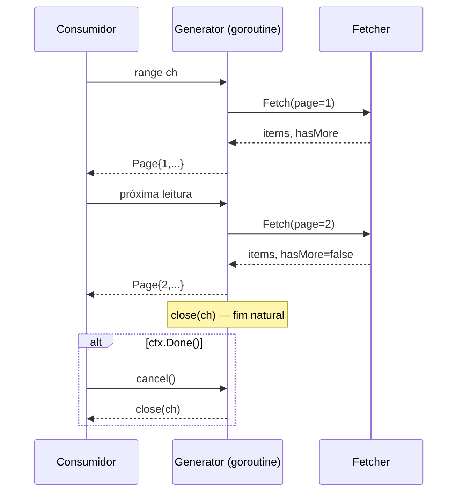

# Generator

## Problema

Você precisa consumir dados paginados ou infinitos (stream de eventos, paginação de API, sequência matemática) sem carregar tudo em memória nem acoplar o consumidor à lógica de paginação. Go não tem `yield` nativo pré-1.23, mas goroutine + canal resolvem idiomaticamente.

## Solução

Uma goroutine produz itens sob demanda e envia via canal. O consumidor lê um por vez; a goroutine bloqueia até haver espaço no canal (lazy). Cancelamento via `context.Context` garante que o gerador pare mesmo quando o consumidor abandona o stream, sem vazar goroutines.



## Cenário de produção

SDK que expõe paginação transparente: cliente faz `for page := range sdk.List(ctx)` e o gerador cuida dos `page tokens` internamente. Funciona igual para APIs finitas (listar usuários) e infinitas (stream de eventos / server-sent events).

## Estrutura

- `generator.go` — `PageGenerator`, `Take`, `StaticFetcher`, `TokenFetcher`.
- `main.go` — demonstração paginação finita + stream infinito com `Take`.
- `generator_test.go` — testes de finito, infinito, cancelamento e erro.

## Como rodar

```bash
cd 042/26-generator && go run .
```

## Como testar

```bash
go test -race -v ./...
```

## Quando usar

- Dados paginados, cursor-based ou streaming.
- Quando o consumidor pode querer parar antes do fim (`break` no range).
- Quando ordem importa e paralelismo não é o objetivo.

## Quando NÃO usar

- Volume pequeno e conhecido: um slice resolve.
- Precisa de paralelismo entre páginas (use fan-out).
- Quer reprocessar/rewind: generator é one-shot.

## Trade-offs

- Simples e idiomático, mas uma goroutine fica viva enquanto houver consumo. Sem `ctx.Done()`, abandonar o range vaza goroutine.
- Canal sem buffer = lazy puro, porém cada `Fetch` é síncrono com o consumo.
- Em Go 1.23+, `range-over-func` pode substituir este padrão; aqui mantemos a abordagem portátil com canal.
