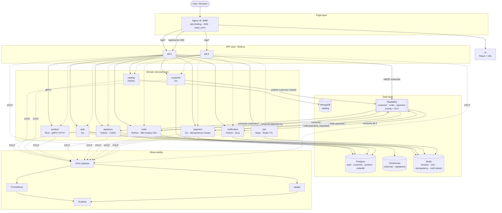
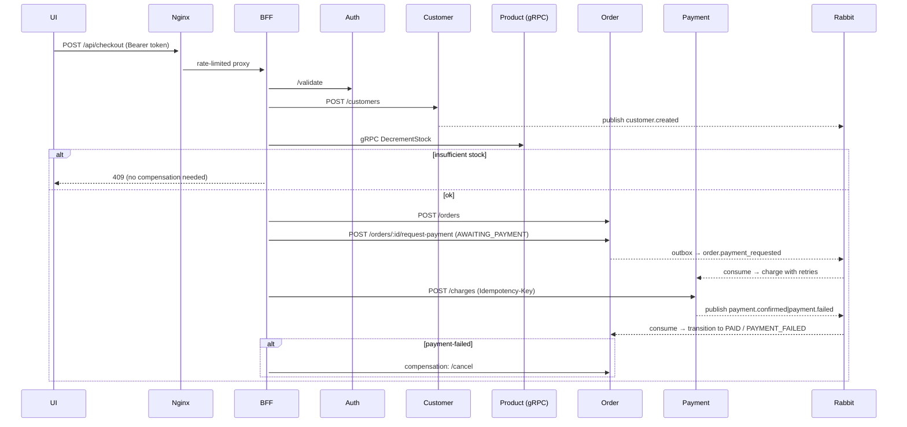

# 057 · Distributed Microservices Playground

A polyglot, end-to-end microservices stack that simulates a real
e-commerce system. It exercises the patterns you actually see in
production: **BFF**, **load balancing**, **Saga with compensation**,
**CQRS**, **event sourcing**, **Outbox**, **Circuit Breaker**,
**Idempotency**, **Dead Letter Queue**, **rate limiting**, plus a
**columnar analytics database** sitting next to relational and
document stores, all with **auto-instrumented OpenTelemetry**,
**chaos engineering toggles**, and a **k6 load test**.

Everything runs with a single `docker compose up --build` (or `make up`).

---

## TL;DR

| Concern | Implementation |
|---|---|
| Edge / Load Balancer | Nginx: `least_conn` across 2× BFF replicas, per-IP rate limits (`api` 30r/s, `login` 5r/s), SSE passthrough |
| BFF | Node.js (Fastify) with JWT middleware, `opossum` circuit breaker, gRPC client, **SSE → RabbitMQ** bridge |
| Auth | **Go** (Gin) — Postgres + Redis + JWT |
| Customer | **Go** (Gin) — Postgres + RabbitMQ **publisher** |
| Catalog | **Python** (FastAPI) — MongoDB |
| Product | **Rust** (Axum + Tonic) — Postgres, HTTP **and** gRPC |
| Signature | **Python** (FastAPI) — RabbitMQ **consumer**, ClickHouse (**columnar**), CQRS |
| Order | **Python** (FastAPI) — Postgres, **state machine**, **outbox**, **event sourcing**, consumes payment events |
| Payment | **Go** (Gin) — mock gateway with **exponential-backoff retries**, **idempotency keys** (Redis), publishes `payment.confirmed` / `payment.failed` |
| Notification | **Python** (FastAPI) — multi-topic consumer, channel Strategy (email/sms/push mocks), **DLQ** after N retries |
| Cart | **Node.js** (Fastify) — Redis hash + TTL refresh |
| UI | React + Vite — Auth · Products · Cart · Checkout · Orders · Dashboard · **Live event feed** |
| Messaging | RabbitMQ — topic exchanges `customer.events`, `order.events`, `payment.events` + dead-letter exchange |
| Observability | OTel Collector → Jaeger (traces) + Prometheus (metrics) + Grafana |
| Chaos | `POST /chaos/inject` on `order` and `payment` to toggle latency + error rates |
| Load | `k6` profile in docker-compose (`make load`) |

---

## Architecture



### Checkout Saga (orchestrated, with compensations)



---

## Ports (host)

| Component | URL |
|---|---|
| Frontend + API (via Nginx LB) | http://localhost:8080 |
| Auth              | http://localhost:8001 |
| Customer          | http://localhost:8002 |
| Catalog           | http://localhost:8003 |
| Product (HTTP)    | http://localhost:8004 |
| Product (gRPC)    | localhost:50051 |
| Signature         | http://localhost:8005 |
| Order             | http://localhost:8006 |
| Payment           | http://localhost:8007 |
| Notification      | http://localhost:8008 |
| Cart              | http://localhost:8009 |
| RabbitMQ UI       | http://localhost:15672 (guest/guest) |
| ClickHouse HTTP   | http://localhost:8123 |
| Jaeger            | http://localhost:16686 |
| Prometheus        | http://localhost:9090 |
| Grafana           | http://localhost:3001 (admin/admin) |

---

## Design patterns

| Pattern | Where |
|---|---|
| **BFF** | `services/bff` aggregates the nine backends, exposes a single API surface to the UI. |
| **Repository** | Every service. See e.g. `services/order/app/repository.py`, `services/product/src/repository.rs`. |
| **CQRS** | Signature writes come from a RabbitMQ consumer, reads from ClickHouse aggregates. |
| **Saga (orchestration) + Compensation** | `services/bff/src/routes/checkout.js` pushes a LIFO stack of compensations; on failure runs them in reverse. |
| **Outbox** | `services/order/app/outbox.py` — same transaction writes domain rows + `outbox` entry; background worker drains to RabbitMQ. Guarantees at-least-once without dual-writes. |
| **Event Sourcing (history log)** | Every state transition in `order` appends to `order_events`. Hit `/orders/{id}/history` to replay the story. |
| **State Machine** | `services/order/app/state_machine.py` — invalid transitions raise `InvalidTransition` (409). |
| **Idempotency** | `services/payment/internal/idempotency` stores responses in Redis keyed by `Idempotency-Key`. Replays return the cached response. |
| **Retry with exponential backoff + jitter** | `services/payment/internal/payment/gateway.go`. |
| **Circuit Breaker** | `services/bff/src/clients/http.js` using `opossum`. |
| **Dead Letter Queue** | `services/notification/app/consumer.py` — after `MAX_RETRIES` failures the message is parked on `notification.dlx`. |
| **Strategy** | Notification channels (email/sms/push) — `pick_channels(event_type)` picks the route. |
| **Rate Limiting** | Nginx `limit_req_zone`, tighter zone on `/api/auth/login`. |
| **Pub/Sub (topic)** | RabbitMQ topic exchanges: `customer.events`, `order.events`, `payment.events` + fan-out DLX. |
| **SSE live projection** | BFF subscribes to all three exchanges with exclusive queues and fans out to every browser via `/api/events`. |
| **Session/cache** | Redis: auth sessions, cart (with TTL refresh), payment idempotency, notification stream. |
| **Chaos engineering** | `POST /chaos/inject { latency_ms, error_rate }` on order and payment, wired as middleware. |

---

## Communication patterns

- **Sync HTTP/JSON** between BFF and most services.
- **Sync gRPC** between BFF and product (`proto/product.proto`).
- **Async AMQP (topic)** between customer/order/payment and signature/notification.
- **Transactional Outbox** between order's Postgres txn and RabbitMQ.
- **Server-Sent Events** from BFF to the browser, bridged from RabbitMQ.

---

## Data stores

| Store | Used by | Why |
|---|---|---|
| Postgres | auth, customer, product, order | Strong consistency + transactions (outbox needs the same txn as the domain write). |
| MongoDB | catalog | Flexible schema for nested catalog metadata. |
| Redis | auth, cart, payment, notification | Session, TTL-scoped cart, idempotency cache, SSE stream buffer. |
| ClickHouse | signature | **Columnar** OLAP — `GROUP BY plan` over millions of rows in milliseconds. |
| RabbitMQ | customer, order, payment, notification, BFF (SSE) | Async fan-out + durable topic exchange + DLX. |

---

## Auto-instrumentation (OpenTelemetry)

- **Node.js** (`bff`, `cart`) → `node -r ./otel.cjs` loads `@opentelemetry/auto-instrumentations-node` before app code. Patches `http`, `fastify`, `grpc`, `amqplib`, `ioredis`.
- **Python** (`catalog`, `signature`, `order`, `notification`) → containers start via `opentelemetry-instrument`. `opentelemetry-bootstrap -a install` at build time pulls in FastAPI, asyncpg, pymongo, aio-pika, redis instrumentation.
- **Go** (`auth`, `customer`, `payment`) → `otelgin.Middleware` for HTTP plus OTLP/gRPC exporter.
- **Rust** (`product`) → `tracing-opentelemetry` layer with `opentelemetry-otlp` gRPC exporter.

All exporters point at `otel-collector:4317`. The collector fans traces to Jaeger, metrics to Prometheus.

---

## Run / demo

```bash
make up       # docker compose up --build -d
make seed     # populate demo data via the public API
make load     # start a 60s k6 ramp against /api/checkout
make chaos-slow   # inject 1.5s latency on order + payment
make chaos-off    # turn chaos back off
make test     # run every service's unit tests locally
make down     # stop (keeps volumes)
make nuke     # stop and drop everything
```

### Demo flow

1. **Auth** tab → register + login with `demo@057.test` / `demo12345` (or whatever you want). The token goes into localStorage and the BFF's JWT middleware validates every subsequent call against the auth service.
2. **Products** → create a product. Request: UI → Nginx → BFF → **gRPC** → Rust product service → Postgres.
3. **Cart** → add items. Hits Redis via the Node cart service; TTL refreshes on every write.
4. **Checkout** → runs the saga:
   - Customer created (Go) → publishes `customer.created` to RabbitMQ.
   - Stock decremented via **gRPC** on the Rust product service.
   - **Order** created with status `CREATED` → transitioned to `AWAITING_PAYMENT` (transactional outbox writes an `order.payment_requested` event).
   - **Payment** processed synchronously (with `Idempotency-Key`) — also reacts async to `order.payment_requested` via its own consumer. Payment publishes `payment.confirmed` / `payment.failed` which the order consumer uses to transition to `PAID` / `PAYMENT_FAILED`.
   - Notification service fans out to email/push/sms mocks per routing rules.
   - If any step fails, compensations run in reverse (cancel order, log restore-stock).
5. **Orders** → paste the customer id, see the lifecycle; click *history* to inspect the event-sourced audit trail.
6. **Live** → SSE feed streaming every domain event as it happens across all three exchanges.
7. **Dashboard** → ClickHouse `GROUP BY plan` aggregation.
8. **Jaeger** (http://localhost:16686) → one end-to-end trace spans Nginx → BFF → customer/product/order/payment/signature/notification across HTTP + gRPC + AMQP.

### cURL crash-course

```bash
BASE=http://localhost:8080/api

TOKEN=$(curl -s -X POST $BASE/auth/register \
   -H 'content-type: application/json' \
   -d '{"email":"foo@057.test","password":"hunter2"}' >/dev/null \
   && curl -s -X POST $BASE/auth/login \
      -H 'content-type: application/json' \
      -d '{"email":"foo@057.test","password":"hunter2"}' | jq -r .access_token)

H="Authorization: Bearer $TOKEN"

# Idempotent charge — retries return the cached response
curl -s -X POST $BASE/payments/charges -H "$H" -H 'content-type: application/json' \
  -H 'Idempotency-Key: demo-key-1' \
  -d '{"order_id":"test-001","amount":19.99}' | jq
curl -s -X POST $BASE/payments/charges -H "$H" -H 'content-type: application/json' \
  -H 'Idempotency-Key: demo-key-1' \
  -d '{"order_id":"test-001","amount":19.99}' -D -

# Chaos — 50% error rate on the payment service
curl -s -X POST localhost:8007/chaos/inject -H 'content-type: application/json' \
  -d '{"error_rate":0.5}'

# Event-sourced history of an order
curl -s $BASE/orders/<order-id>/history -H "$H" | jq
```

---

## Tests

```bash
make test
```

Runs:
- Go (`auth`, `customer`, `payment`) via `go test ./...`
- Python (`catalog`, `signature`, `notification`, `order`) via `pytest`
- Node (`bff`, `cart`) via `node --test test/*.test.js`

Rust (`product`) has its own `cargo test` suite — use the Dockerfile or install the rust toolchain locally.

---

## Project layout

```
057/
├── Makefile                  # convenience targets
├── docker-compose.yml        # single entrypoint
├── proto/product.proto       # shared gRPC contract
├── load/checkout.js          # k6 ramp (used by `make load`)
├── scripts/seed.sh           # demo data bootstrap
├── infra/
│   ├── nginx/                # LB + UI site config (rate limits, SSE)
│   ├── otel/                 # collector pipeline
│   ├── prometheus/           # scrape config
│   ├── grafana/              # provisioned dashboards + datasources
│   ├── postgres/init.sql     # auth · customer · product · orderdb
│   └── rabbitmq/             # enabled plugins
└── services/
    ├── auth/          (Go   — JWT · Postgres · Redis)
    ├── customer/      (Go   — Postgres · RabbitMQ publisher)
    ├── catalog/       (Py   — MongoDB)
    ├── product/       (Rust — Postgres · HTTP + gRPC)
    ├── signature/     (Py   — ClickHouse · RabbitMQ consumer · CQRS)
    ├── order/         (Py   — Postgres · state machine · outbox · event sourcing · chaos)
    ├── payment/       (Go   — idempotency · retries · chaos · publishes events)
    ├── notification/  (Py   — multi-topic consumer · DLQ · channel strategy)
    ├── cart/          (Node — Redis TTL cart)
    ├── bff/           (Node — Fastify · JWT · circuit breaker · gRPC · SSE bridge)
    └── ui/            (React + Vite, served via Nginx)
```

---

## Caveats

- Secrets are hardcoded for local dev only.
- First `docker compose build` is slow — Rust alone pulls a lot of crates.
- Clickhouse Grafana datasource expects the plugin installed; Prometheus + Jaeger datasources work out of the box.
- The Nginx login rate limit (5 req/s per IP) can trip seed scripts on fast machines — rerun `make seed` if a step gets 429.
